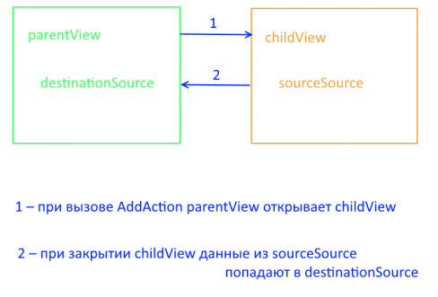

Создает новый элемент в [источнике данных](../../DataSources).

# Syntax

```js
new AddAction(parentView)
```
## Parameters

|Name|Type|Description|
|----|----------|---------|
|parentView|[`View`](../../Elements/View/)| Родительское представление |

# Properties

Для работы с данными свойствами используйте методы [getProperty](../BaseAction/BaseAction.getProperty/) и [setProperty](../BaseAction/BaseAction.setProperty/).

|Name|Type|Description|
|----|----|-----------|
|linkView|[`LinkView`](../../Elements/View/LinkView/)|Объект, который будет создавать и настраивать [представление](../../Elements/View/) для создания нового элемента|
|sourceSource|`String`|Название редактируемого источника данных на представлении создания|
|destinationSource|`String`|Название редактируемого источника данных, на представлении, откуда создание было вызвано|
|destinationProperty|`String`| (Необязательное) Путь до поля в источнике данных, которое будет редактироваться. Данное поле должно быть представлено массивом|

Обратите внимание, что если не указать destinationProperty, то новый элемент будет добавляться непосредственно в источник данных, соответствующий destinationSource, иначе - добавиться в список элементов, соответствующий destinationProperty.




# Examples

Рассмотрим вариант, когда на представлении parentView, нужно задать действие добавления пациента (пациенты хранятся в источнике данных Patients):

```js
var linkView = (new InlineViewBuilder()).build(null, {
														builder: args.builder, 
														metadata: {View: editPatientView}, 
														parentView: parentView
													});

var addAction = new AddAction(parentView);

addAction.setProperty('linkView', linkView);
addAction.setProperty('sourceSource', 'MainDataSource');
addAction.setProperty('destinationSource', 'Patients');

addAction.execute(); 
```

Теперь рассмотрим случай, когда текущему пациенту необходимо добавлять госпитализации (поле Hospitalizations):

```js
var linkView = (new InlineViewBuilder()).build(null, {
														builder: args.builder, 
														metadata: {View: editHospitalizationView}, 
														parentView: parentView
													});

var addAction = new AddAction(parentView);

addAction.setProperty('linkView', linkView);
addAction.setProperty('sourceSource', 'MainDataSource');
addAction.setProperty('destinationSource', 'Patients');
addAction.setProperty('destinationProperty', '$.Hospitalizations');

addAction.execute(); 
```

# See Also

* [`EditAction`](../EditAction/)
* [`DeleteAction`](../DeleteAction/)
* [`getProperty`](../BaseAction/BaseAction.getProperty/)
* [`setProperty`](../BaseAction/BaseAction.setProperty/)