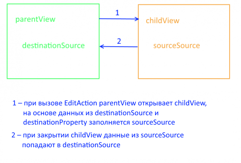

Редактирует элемент из [источника данных](../../DataSources).

# Syntax

```js
new EditAction(parentView)
```
## Parameters

|Name|Type|Description|
|----|----------|---------|
|parentView|[`View`](../../Elements/View/)| Родительское представление |

# Properties

Для работы с данными свойствами используйте методы [getProperty](../BaseAction/BaseAction.getProperty/) и [setProperty](../BaseAction/BaseAction.setProperty/).

|Name|Type|Description|
|----|----|-----------|
|linkView|[`LinkView`](../../LinkView/)|Объект, который будет создавать и настраивать [представление](../../Elements/View/) для создания нового элемента|
|sourceSource|`String`|Название редактируемого источника данных на представлении редактирования|
|destinationSource|`String`|Название редактируемого источника данных на представлении, откуда редактирование было вызвано|
|destinationProperty|`String`|Путь до поля в источнике данных, которое будет редактироваться|




# Examples

```js
var linkView = (new InlineViewBuilder()).build(null, {
														builder: args.builder, 
														metadata: {View: editPatientView}, 
														parentView: parentView
													});

var editAction = new EditAction(parentView);

editAction.setProperty('linkView', linkView);
editAction.setProperty('sourceSource', 'MainDataSource');
editAction.setProperty('destinationSource', 'Patients');
editAction.setProperty('destinationProperty', '$');

editAction.execute(); // откроется форма редактирования текущего пациента
```

# See Also

* [`AddAction`](../AddAction/)
* [`DeleteAction`](../DeleteAction/)
* [`getProperty`](../BaseAction/BaseAction.getProperty/)
* [`setProperty`](../BaseAction/BaseAction.setProperty/)