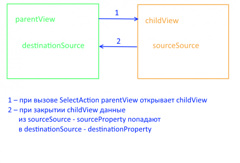

Заполняет поле элемента в [источнике данных](../../DataSources) данными из другого элемента [источника данных](../../DataSources).

# Syntax

```js
new SelectAction(parentView)
```
## Parameters

|Name|Type|Description|
|----|----------|---------|
|parentView|[`View`](../../Elements/View/)| Родительское представление |

# Properties

Для работы с данными свойствами используйте методы [getProperty](../BaseAction/BaseAction.getProperty/) и [setProperty](../BaseAction/BaseAction.setProperty/).

|Name|Type|Description|
|----|----|-----------|
|linkView|[`LinkView`](../../LinkView/)|Объект, который будет создавать и настраивать [представление](../../Elements/View/) для выбора нового значения поля|
|sourceSource|`String`|Название источника данных, из которого будет заполняться редактируемый источник данных|
|sourceProperty|`String`|Путь до поля в источнике данных, которое будет копироваться|
|destinationSource|`String`|Название редактируемого источника данных|
|destinationProperty|`String`|Путь до поля в источнике данных, которое будет редактироваться|




# Examples

```js
var linkView = (new InlineViewBuilder()).build(null, {
														builder: args.builder, 
														metadata: {View: selectPatientView}, 
														parentView: parentView
													});

var selectAction = new SelectAction(parentView);

selectAction.setProperty('linkView', linkView);
selectAction.setProperty('destinationSource', 'Hospitalizations');
selectAction.setProperty('destinationProperty', '$.Patient');
selectAction.setProperty('sourceSource', 'Patients');
selectAction.setProperty('sourceProperty', '$');

selectAction.execute();//откроет окно выбора пациента. Выбранный пацент будет записан в текущей госпитализации
```


# See Also

* [`getProperty`](../BaseAction/BaseAction.getProperty/)
* [`setProperty`](../BaseAction/BaseAction.setProperty/)