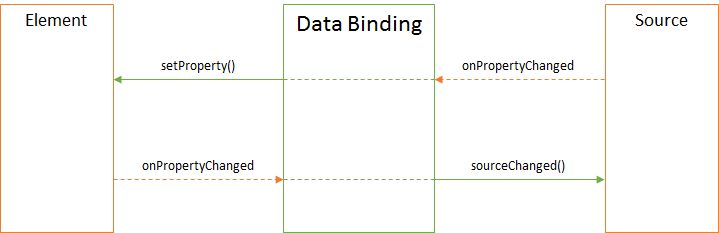

Привязка данных между элементом и источником.

# Description

Привязка данных позволяет синхронизировать значения свойств двух различных объектов. Один объект
условно называется элементом, другой - источником. В роли элемента чаще всего выступают
[элементы](../Elements/) [визуального представления](../Elements/View/), в роли
источника - [источники данных](../DataSources/). Принципиально не важно, какой элемент будет
элементом, а какой источником, так как оба реализуют один и тот же интерфейс. Объектами, которые
поддерживают привязку данных являются все типы визуальных [визуальных элементов](../Elements/),
все типы [источников данных](../DataSources/) и [параметр представления](../Parameter).

Любая привязка данных представлена невизуальным программным объектом, который позволяет указать
[правила преобразования данных](BindingConverter/) для элемента и источника, а также желаемое
[направление потока данных в привязке](BindingMode/):

* Двунаправленный обмен между элементом и источником (two way) - если в источнике произошли изменения,
элемент обновляется, и, наоборот, если изменения произошли в элементе, источник обновляется.
* Только обновление источника (to source) - если в источнике произошли изменения, элемент не обновляется,
но, если изменения произошли в элементе, источник обновляется.
* Только обновление элемента (to element) - если в источнике произошли изменения, элемент обновляется,
но, если изменения произошли в элементе, источник не обновляется.

Таким образом, привязка данных скрывает всю сложность синхронизации между элементом и источником,
что в значительной степени упрощает код и обеспечивает предсказуемость поведения всех элементов.



# Syntax

```js
new DataBinding()
```

## Parameters

Нет

# Usage

```js
//js-demo
var element = new TextBox();
var $element = element.render();
element.setLabelText("Element");

var source = new TextBox();
var $source = source.render();
source.setLabelText("Source");

var binding = new DataBinding();
binding.setMode('ToSource');
binding.bindSource(source, 'value');
binding.bindElement(element, 'value');

$elementForExample.append($element);
$elementForExample.append($source);
```

# Methods

|Name|Description|
|----|---------|
|[getMode](DataBinding.getMode/)|Возвращает [направление потока данных в привязке](BindingMode/)|
|[setMode](DataBinding.setMode/)|Устанавливает [направление потока данных в привязке](BindingMode/)|
|[getConverter](DataBinding.getConverter/)|Возвращает [преобразователь данных между элементом и источником](BindingConverter/)|
|[setConverter](DataBinding.setConverter/)|Устанавливает [преобразователь данных между элементом и источником](BindingConverter/)|
|[bindSource](DataBinding.bindSource/)|Устанавливает привязку к источнику|
|[getSource](DataBinding.getSource/)|Возвращает источник данных привязки|
|[getSourceProperty](DataBinding.getSourceProperty/)|Возвращает путь к свойству источника данных привязки|
|[bindElement](DataBinding.bindElement/)|Устанавливает привязку к элементу|
|[getElement](DataBinding.getElement/)|Возвращает элемент привязки|
|[getElementProperty](DataBinding.getElementProperty/)|Возвращает путь к свойству элемента привязки|
|[getDefaultValue](DataBinding.getDefaultValue/)|Возвращает значение по умолчанию для элемента|
|[setDefaultValue](DataBinding.setDefaultValue/)|Устанавливает значение по умолчанию для элемента|

# Events

Нет