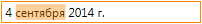
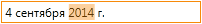

Маска ввода даты/времени.

  

Маска должна записываться в формате, который описан в разделе [DateTimeFormatting](../../Culture/Culture.dateTimeFormatting/).
   
Поведение маски ввода:

* Нажатие клавиши "пробел" выделяет следующий раздел маски, который можно редактировать.
* Ввод разделителя даты выделяет следующий раздел маски по редактированию даты.
* Ввод разделителя времени выделяет следующий раздел маски по редактированию времени.
* Нажатие клавиш `↑` и `↓` увеличивает или уменьшает в допустимых диапазонах выделенный раздел маски (год, месяц, день, час, минута, секунда, половина суток).

# Properties

Name|Type|Description
----|----|-----------
Mask|`String`|Маска редактирования

# Examples

```json
{
    "DateTimeEditMask": {
        "Mask": "d"
    }
}
```   
 
```json
{
    "DateTimeEditMask": {
        "Mask": "d MMMM yyyy"
    }
}
```  

```js
//js-demo

var metadata = {
    TextBox: {
        EditMask: {
            DateTimeEditMask: {
                Mask: "dd MM yyyy"
            }
        },
        DisplayFormat: {
            DateTimeFormat: {
                Format: "dd MMMM yyyy"
            }
        }
    }
};

var builder = new ApplicationBuilder();
var textbox = builder.build(metadata);

//  Render
$elementForExample.append(textbox.render());
```