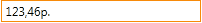

Маска ввода числового значения.

  
   

Маска должна записываться в формате, который описан в разделе [NumberFormatting](../../Culture/Culture.numberFormatting/).
   
Поведение маски ввода:

* Нажатие клавиши `-` меняет знак редактируемого значения, не меняя значения каретки, где бы она не находилась.
* Нажатие клавиш `↑` и `↓` увеличивает или уменьшает на 1 значение цифры слева от каретки.
   

# Properties

|Name|Type|Description|
|----|----|-----------|
|Mask|`String`|Маска редактирования|

# Examples

```json
{
    "NumberEditMask": {
        "Mask": "n3"
     }
}
```
   
```json
{
    "NumberEditMask": {
        "Mask": "c3"
     }
}
```   

```js
//js-demo

var metadata = {
    TextBox: {
        EditMask: {
            NumberEditMask: {
                Mask: "c3"
            }
        },
        DisplayFormat: {
            NumberFormat: {
                Format: "c3"
            }
        }
    }
};

var builder = new ApplicationBuilder();
var textbox = builder.build(metadata);

//  Render
$elementForExample.append(textbox.render());
```