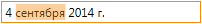

Маска ввода данных.

Маска ввода данных используется в том случае, если необходимо, чтобы конечный пользователь вводил данные в строго определенном формате. Маска должна применяться только в режиме ввода данных, для отображения данных используется [DisplayFormat](../DisplayFormat/). Когда редактор, использующий маску, переходит в режим ввода данных, он предоставляет пользователю текстовое поле, которое позволяет вводить данные в том формате, которые определены маской. Например, может возникнуть задача, чтобы в поле ввода можно было вводить дату только в 24-часовом формате или только целые числа. Другой пример - ввод номера телефона. Для решения подобных задач как раз и предназначена маска ввода данных.

# Типы масок ввода

Базовый набор свойств маски ввода данных описан в разделе BaseEditMask, ниже перечислены основные типы масок ввода.

## [DateTimeEditMask](DateTimeEditMask/)

Редактор позволяет вводить дату/время только в определенном формате.

Маска значительно упрощает ввода даты/времени в нужном формате особенно, когда речь идет о клавиатурном вводе. Маска предоставляет возможность указать несколько предустановленных, часто используемых шаблонов ввода даты/времени. Наряду с этим имеется возможность указать специфическую строку форматирования для ввода даты/времени, оперируя такими составными элементами, как год, месяц, день, часы, минуты, секунды и т.д.

## [NumberEditMask](NumberEditMask/)	

Редактор позволяет вводить числовые значения только в определенном формате.
	

Маска значительно упрощает ввод числовых значений в нужном формате (целых и дробных чисел, значений денежных единиц, процентов и т.д.), особенно, когда речь идет о клавиатурном вводе. Маска предоставляет возможность указать несколько предустановленных, часто используемых шаблонов ввода числовых значений. Наряду с этим имеется возможность указать специфическую строку форматирования.

## [TemplateEditMask](TemplateEditMask/)	

Редактор позволяет вводить строку в фиксированном формате.	

Маска поддерживает символы, которые определяют простые правила ввода. Например, можно определить правило, что номер телефона должен начинаться с кода, который состоит из 3 цифр. Спецсимволы и литералы могут отображаться при вводе данных, но будут пропускаться при редактировании (например, дефисы в телефонных номерах будут проставляться автоматически). Из-за простоты формата маски (в отличие от регулярных выражений), есть возможность качественно реализовать автозаполнение, облегчив ввод данных.