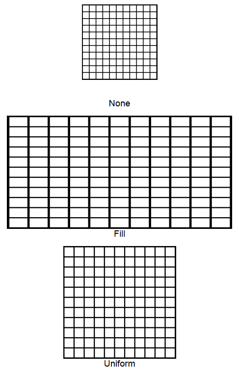

Растягивание изображения.

   

#### Type

enum

   

#### Description  

|Value|Description|
|-----|-----------|
|None|Не растягивать изображение.|
|Fill|Растягивать изображение по размеру контейнера.|
|Uniform|Растягивать изображение по размеру контейнера с сохранением пропорций.|

   

#### Schema

```
{
  "id": "PrintElementImageStretch",
  "description": "Растягивание изображения",
  "enum": [
    "None",
    "Fill",
    "Uniform"
  ]
}
```

   

#### Example



 

 

