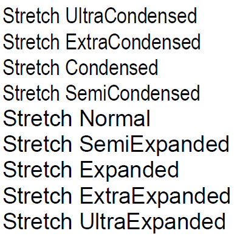

Степень растягивания шрифта по горизонтали.

   

Многие шрифты поддерживают не все уровни растягивания, а некоторые вообще не поддерживают растягивания (например, [моноширные](https://en.wikipedia.org/wiki/Monospaced_font) шрифты типа "Courier New").

   

#### Type

enum

  

#### Description  

|Value|Description|
|-----|-----------|
|UltraCondensed|Ультра-уплотненный (50% от нормального).|
|ExtraCondensed|Экстра-уплотненный (62.5% от нормального).|
|Condensed|Уплотненный (75.0% от нормального).|
|SemiCondensed|Полууплотненный (87.5% от нормального).|
|Normal|Нормальный (100%).|
|SemiExpanded|Полурастянутый (112.5% от нормального).|
|Expanded|Растянутый (125.0% от нормального).|
|ExtraExpanded|Экстра-растянутый (150.0% от нормального).|
|UltraExpanded|Ультра-растянутый (200.0% от нормального).|

 

#### Schema

```
{
  "id": "FontStretch",
  "description": "Степень растягивания шрифта по горизонтали",
  "enum": [
    "UltraCondensed",
    "ExtraCondensed",
    "Condensed",
    "SemiCondensed",
    "Normal",
    "SemiExpanded",
    "Expanded",
    "ExtraExpanded",
    "UltraExpanded"
  ]
}
```

   

#### Example



 

 

