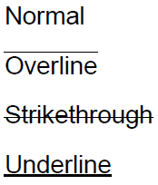

Оформление текста элемента печатного представления.

   

#### Type

enum

  

#### Description  

|Value|Description|
|-----|-----------|
|Normal|Без оформления.|
|Overline|Линия над текстом.|
|Strikethrough|Линия поверх текста (зачеркнутый текст).|
|Underline|Линия под текста (подчеркнутый текст).|

   

#### Schema

```
{
  "id": "PrintElementTextDecoration",
  "description": "Оформление текста элемента печатного представления",
  "enum": [
    "Normal",
    "Overline",
    "Strikethrough",
    "Underline"
  ]
}
```

   

#### Example



 

 

