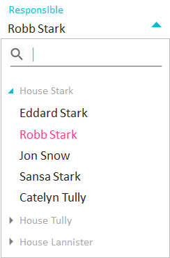
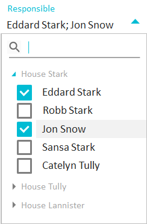
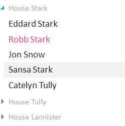
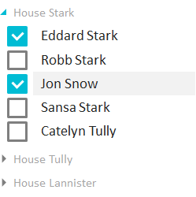
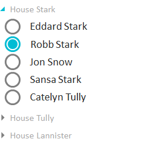
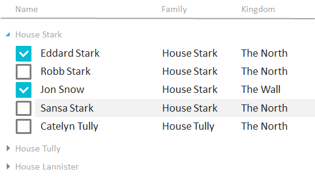

Шаблон для создания групп элементов списка.

   

Элементы списка могут быть сгруппированы. Правила группировки и отображения групп настраиваются с помощью свойства GroupTemplate.

   

#### Examples

 

[[ComboBox]]

   

   

[[ListBox]]

   

   

[[RadioGroup]]

   

[[DataGrid]]

   

 

 

