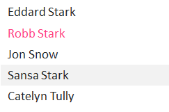
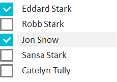

Элемент представления для выбора одного или нескольких значений из списка.

Элемент может работать в двух режимах: выбор одного значения, выбор нескольких значений (см. рис.).

   

#### Sketch

   

    

#### Methods

|Name|Description|
|----|-----------|
| | |

    

#### Events

|Name|Description|
|----|-----------|
| | |

    

#### Schema

```
{
  "id": "ListBox",
  "description": "Элемент представления для выбора одного или нескольких значений из списка",
  "type": "object",
  "extends": {
    "$ref": "http://demo.infinnity.ru:8081/display/MC/BaseListElement"
  },
  "properties": {},
  "additionalProperties": false
}
```

   

#### Implementation

ListBox не должен иметь каких-либо границ, рамок и т.п. элементов, поскольку для этих целей служит [[ItemTemplate|BaseListElement.ItemTemplate]].

 

#### Examples

```
{
  "ValueProperty": "Phone",
  "ItemTemplate": {
    "StackPanel": {
      "Orientation": "Horizontal",
      "Items": [
        {
          "ImageBox": {
            "Value": {
              "PropertyBinding": {
                "DataSource": "MainDataSource",
                "Property": "$.Photo"
              }
            }
          }
        },
        {
          "Label": {
            "DisplayFormat": {
              "ObjectFormat": {
                "Format": "{LastName}, {FirstName}"
              }
            },
            "Value": {
              "PropertyBinding": {
                "DataSource": "MainDataSource",
                "Property": "$"
              }
            }
          }
        }
      ]
    }
  },
  "Items": {
    "PropertyBinding": {
      "DataSource": "MainDataSource"
    }
  }
}
```

   

 

