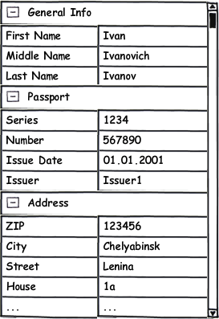

Элемент представления для отображения данных объекта в виде вертикальной таблицы.

Обратите внимание, что категории могут содержать не только свойства, но и вложенные категории (подкатегории).

 



 

|Name|Description|
|----|-----------|
|GetCategories(): array<[[PropertyCategory]]>|Возвращает список категорий свойств объекта.|
|GetReadOnly(): boolean|Возвращает значение, определяющее, запрещено ли редактирование значения.|
|SetReadOnly(boolean)|Устанавливает значение, определяющее, запрещено ли редактирование значения.|
|GetValue(): any|Возвращает редактируемый объект.|
|SetValue(any)|Устанавливает редактируемый объект.|
|ClearValue()|Сбрасывает редактируемый объект.|

|Name|Description|
|----|-----------|
|OnValueChanged|Событие изменения значения.|

    

```
{
	"id": "PropertyGrid",
	"description": "Элемент представления для отображения данных объекта в виде вертикальной таблицы",
	"type": "object",
	"extends": {
		"$ref": "http://demo.infinnity.ru:8081/display/MC/Element"
	},
	"properties": {
		"Categories": {
			"description": "Список категорий свойств объекта",
			"type": "array",
			"items": {
				"$ref": "http://demo.infinnity.ru:8081/display/MC/PropertyCategory"
			}
		},
		"ReadOnly": {
			"description": "Запрещено ли редактирование значения",
			"type": "boolean",
			"default": false
		},
		"Value": {
			"description": "Привязка данных для значения",
			"$ref": "http://demo.infinnity.ru:8081/display/MC/DataBinding"
		},
		"OnValueChanged": {
			"description": "Обработчик события изменения значения",
			"$ref": "http://demo.infinnity.ru:8081/display/MC/LinkScript"
		}
	}
}
```

```
{
	"Name": "PropertyGrid1",
	"Categories": [
		{
			"Text": "Общая информация",
			"Properties": [
				{
					"Text": "Имя",
					"Property": "FirstName"
				},
				{
					"Text": "Отчество",
					"Property": "MiddleName"
				},
				{
					"Text": "Фамилия",
					"Property": "LastName"
				}
			]
		}
	],
	"Value": {
		"PropertyBinding": {
			"DataSource": "EditObjectDataSource"
		}
	}
}
```

 

 

