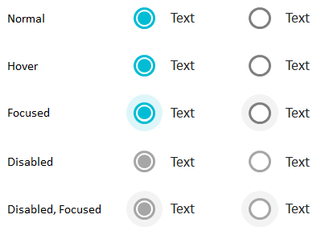

Элемент представления для выбора одного значения из списка.

Элемент обладает всеми свойствами, присущими [[BaseListElement]], однако игнорирует свойство [[MultiSelect|BaseListElement.MultiSelect]].

   

#### Sketch

  


   

#### Methods

|Name|Description|
|----|-----------|
|GetOrientation(): [[RadioGroupOrientation]]|Возвращает ориентацию списка элементов.|
|SetOrientation([[RadioGroupOrientation]] value)|Устанавливает ориентацию списка элементов.|

   

#### Events

|Name|Description|
|----|-----------|
| | |

    

####  Schema

```
{
  "id": "RadioGroup",
  "description": "Элемент представления для выбора одного значения из списка",
  "type": "object",
  "extends": {
    "$ref": "http://demo.infinnity.ru:8081/display/MC/BaseListElement"
  },
  "properties": {
    "Orientation": {
      "description": "Ориентация списка элементов",
      "$ref": "http://demo.infinnity.ru:8081/display/MC/RadioGroupOrientation"
    }
  },
  "additionalProperties": false
}
```

   

 

