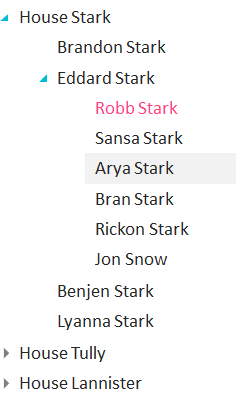
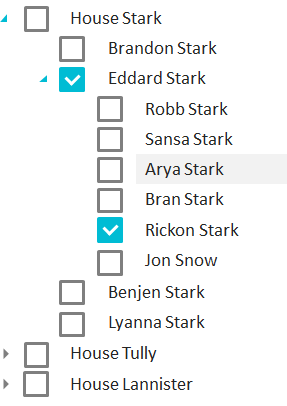

Элемент представления для отображения данных в виде дерева.

   

#### Sketch

   

   

#### Methods

|Name|Description|
|----|-----------|
|GetKeyProperty(): string|Возвращает свойство элемента источника данных, которое хранит идентификатор элемента.|
|SetKeyProperty(string value)|Устанавливает свойство элемента источника данных, которое хранит идентификатор элемента.|
| | |
|GetParentProperty(): string|Возвращает свойство элемента источника данных, которое хранит идентификатор родителя.|
|SetParentProperty(string value)|Устанавливает свойство элемента источника данных, которое хранит идентификатор родителя.|

   

#### Events

|Name|Description|
|----|-----------|
| | |

       

#### Schema

```
{
  "id": "TreeView",
  "description": "Элемент представления для отображения данных в виде дерева",
  "type": "object",
  "extends": {
    "$ref": "http://demo.infinnity.ru:8081/display/MC/BaseListElement"
  },
  "properties": {
    "KeyProperty": {
      "description": "Свойство элемента источника данных, которое хранит идентификатор элемента",
      "type": "string",
      "required": true
    },
    "ParentProperty": {
      "description": "Свойство элемента источника данных, которое хранит идентификатор родителя",
      "type": "string",
      "required": true
    }
  },
  "additionalProperties": false
}
```

   

#### Implementation

TreeView не должен иметь каких-либо границ, рамок и т.п. элементов, поскольку для этих целей служит [[ItemTemplate|BaseListElement.ItemTemplate]].

   

#### Examples

```
{
  "KeyProperty": "Id",
  "ParentProperty": "ParentId",
  "DisplayProperty": "DisplayName",
  "Items": {
    "PropertyBinding": {
      "DataSource": "MainDataSource"
    }
  }
}
```

 

 

