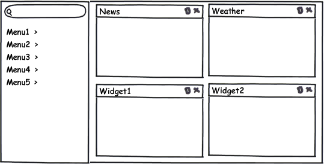
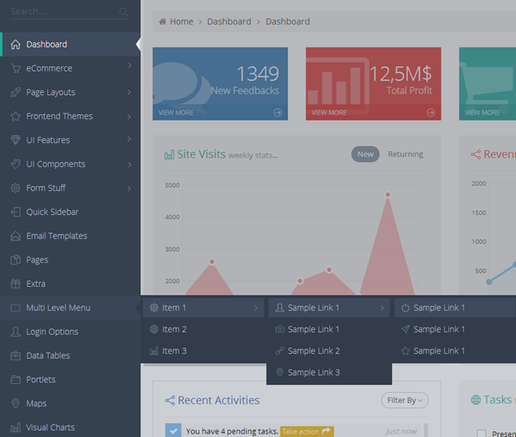

Домашняя страница системы ([[ViewType]].HomePage) - это страница, которую видит пользователь при входе в систему. С технической точки зрения домашняя страница является обычным представлением ([View](http://demo.infinnity.ru:8081/display/MC/View)) и может содержать все что угодно. Однако поскольку данный раздел носит рекомендательный характер, поэтому следует ввести определенные требования к домашней странице. Во-первых, домашняя страница должна содержать главное меню системы ([[MenuBar]]). Во-вторых, вся остальная свободная часть экрана отводится под информационные панели ("виджиты"). Предполагается, что состав, содержимое и расположение информационных панелей может настраиваться под каждого пользователя. Общая схема главной страницы приведена на рисунке ниже.

   

 

#### Примерный внешний вид

 

 

