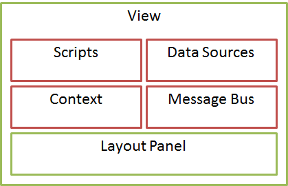

Ключевым понятием при описании интерфейса пользователя является визуальное представление (см. раздел [[View]]). Представление имеет достаточно много аспектов, каждый из которых более подробно будет описан ниже. Пока следует сказать, что каждый из этих аспектов отвечает за достаточно узкий круг задач и никак не зависит от других аспектов представления. Все необходимые связи между аспектами устанавливаются инфраструктурой приложения в момент выполнения (если быть точным, то в момент интерпретации метаданных представления). Подобная независимость и модульность позволяет достаточно свободно расширять модель представления и достаточно просто вносить изменения в каждый из ее аспектов.

Также следует отметить, что представление и все, что с ним связано, не завязано на какую-то конкретную предметную область. Напротив, для обеспечения большей гибкости и расширения границ применения, все аспекты представления, с одной стороны, никак не связаны с конкретной предметной областью, с другой – образуют достаточно полный функциональный базис, используя который можно решить подавляющую часть задач, возникающих на уровне интерфейса пользователя. Естественно, что за подобную универсальность приходится платить и в данном случае это отражается на несколько низкоуровневом характере аспектов представления, но не настолько низкоуровневом, чтобы эти аспекты не были бы понятны прикладному разработчику. Более того, предполагается, что многие задачи будут решаться с использованием автогенерированных представлений, а с учетом наличия механизма, который позволяет прикладным разработчикам разрабатывать генераторы представлений (см. раздел [[Generator]]), подобная расплата за гибкость не кажется такой высокой.

Основные аспекты представления приведены в списке ниже и на иллюстрации.

* [Прикладные скрипты (Scripts)](#scripts)
* [Контекст представления (Context)](#context)  
* [Шина сообщений (Message Bus)](#messagebus)
* [Источники данных (Data Sources)](#datasources)
* [Контейнер элементов (Layout Panel)](#layoutpanel)

 

 

#### Прикладные скрипты

Прикладные скрипты (см. раздел [[Script]]) предназначены для написания прикладных обработчиков, выполняемых на стороне клиента, которые будут срабатывать при возникновении определенных событий в рамках представления. Чаще всего прикладные скрипты представляют собой обработчики событий элементов представления, но могут выступать и в качестве повторно используемых функций, которые могут быть вызваны из любого другого скрипта представления. Прикладные скрипты задают императивную логику обработки некоторого события, используя API, предоставленный платформой. На данный момент эта логика задается на платформенно-специфичном языке программирования: JavaScript (для Web-приложений), Java (для Android-приложений), C# (для Windows-приложений). Возможно, в будущем для написания прикладных скриптов будет использоваться один язык для всех платформ (например, JavaScript), но есть основания предполагать, что в этом, скорей всего, не будет никакого смысла, поскольку каждая платформа слишком индивидуальна и конфигурация для каждой из них будет, скорей всего, своя.

Для обеспечения стабильности работы основной акцент делается на то, чтобы у приложения не было никакого глобального контекста (состояния), который мог бы повлиять на корректность работы приложения. Именно по этой причине все прикладные скрипты регистрируются в рамках представления, а область их видимости ограничена представлением и его элементами. Иными словами, у представления, конечно, есть контекст, но область видимости этого контекста ограничивается представлением, соответственно, у прикладного скрипта в общем случае отсутствует какая-либо возможность повлиять на что-то, что выходит за рамки представления, к которому относится этот скрипт.

#### Контекст представления

Контекст представления (см. раздел [[Context]]) - это программный объект, который хранит состояние представления и предоставляет строго определенный API для доступа к элементам представления. Вызов любого прикладного скрипта или обработчика события сопровождается передачей ему контекста представления, благодаря чему контекст является одним из ключевых аспектов, когда речь заходит о написании прикладных скриптов. Контекст создается для каждого экземпляра представления и время его жизни определяется временем жизни соответствующего экземпляра представления. Иными словами, каждое представление имеет свой контекст, который связан только с данным представлением. Мотивы в подобной изоляции всё те же - для обеспечения стабильности работы приложения. Также следует отметить, что контекст является динамическим объектом и не исключено, что с течением времени, вследствие выполнения прикладных скриптов, контекст может динамически расширяться дополнительными свойствами и методами.

#### Шина сообщений

Представление может иметь достаточно большое количество визуальных и не визуальных элементов, функционально связанных между собой. Более того, со временем количество элементов представления может измениться, количество функциональных связей может измениться, могут появиться новые типы элементов или измениться характер функциональных связей. Если при таких исходных данных функциональную связь между элементами делать императивно, то достаточно быстро произойдет комбинаторный взрыв, и развивать платформу будет невозможно. Однако, несмотря на непредсказуемость и сложность функциональных связей, типы связей достаточно предсказуемы и вполне определены. Все это дает предпосылки использования шины сообщений для организации взаимодействия между элементами представления.

Таким образом, на уровне инфраструктуры все функциональные связи между элементами представления осуществляются через шину сообщений (см. раздел [[MessageBus]]). Правила публикации сообщений в шину и правила подписки на сообщения шины задаются в момент выполнения интерпретации данных представления, абсолютно прозрачно для прикладного разработчика. (Тем не менее, прикладной разработчик может свободно использовать функциональность шины сообщений для реализации своих задач.) В итоге, подобный подход позволил решить многие вышеуказанные проблемы, сохранив самодостаточность и независимость элементов представления.

#### Источники данных

Каждое представление, безусловно, связано с какими-либо данными. В целях унификации и упрощения работы с данными был разработан единый программный интерфейс для работы с данными на уровне представления (см. раздел [[BaseDataSource]]); также было выделено несколько типов источников данных (см. раздел [[DataSource]]), покрывающих подавляющее количество задач с данными на уровне платформы. Источники данных создаются на этапе интерпретации метаданных представления, регистрируются в рамках экземпляра соответствующего представления и доступны через контекст представления.

#### Контейнер элементов

Контейнер элементов представления - визуальный элемент представления, который определяет способ визуального расположения своих дочерних элементов (см. раздел [[LayoutPanel]]). Например, [[TabPanel]] определяет панель закладок, в которых располагаются элементы представления, а [[StackPanel]] располагает элементы представления в виде вертикального или горизонтального стека. Для представления можно определить только один контейнер элементов, но сам контейнер может содержать сколько угодно других контейнеров и элементов в любой их комбинации. Используя различные типы контейнеров, можно построить интерфейс практически любой сложности. Более того, при необходимости, можно свободно дополнять существующие типы контейнеров новыми типами, увеличив гибкость системы.

 

 

