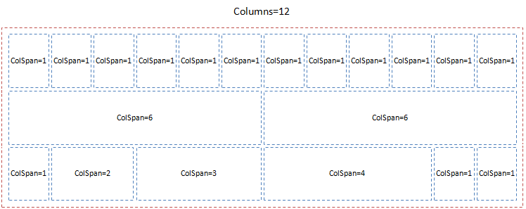

Контейнер элементов представления для размещения элементов слева направо и сверху вниз.

   



   

Элемент WrapPanel должен удовлетворят следующим условиям:

* Границы ячеек не отображаются.
* Элемент занимает все доступное пространство по ширине.
* Элемент имеет регулярную структуру, которая задается рядами и колонками.
* Высота горизонтального ряда ячеек равна высоте самого большого элемента в этом ряду.
* Ячейки могут размещать внутри себя любые элементы представления, в том числе другие WrapPanel.
* Размер ячейки задается количеством колонок, если ячейка не вмещается в остаток колонок ряда, она переносится на новый ряд.
* При изменении размеров элемента расположение ячеек не меняется, ячейки остаются на своих местах, но их размер меняется пропорционально.
* Если размер ячейки превышает количество колонок ряда, она занимает весь ряд.
* Ячейки располагаются в порядке добавления (объявления в метаданных).

   

|Name|Description|
|----|-----------|
|GetColumns(): integer|Возвращает количество колонок.|
|SetColumns(integer value)|Устанавливает количество колонок.|
|AddCell(integer columnSpan): [[GridPanelCell]]|Добавляет ячейку.|
|GetCells(): array<[[GridPanelCell]]>|Возвращает список ячеек.|

|Name|Description|
|----|-----------|
| | |

   

```
{
	"id": "WrapPanel",
	"description": "Контейнер элементов представления для размещения элементов слева направо и сверху вниз",
	"type": "object",
	"extends": {
		"$ref": "http://demo.infinnity.ru:8081/display/MC/Element"
	},
	"properties": {
		"Columns": {
			"description": "Количество колонок",
			"type": "integer",
			"default": 12
		},
		"Cells": {
			"description": "Список ячеек",
			"type": "array",
			"items": {
				"$ref": "http://demo.infinnity.ru:8081/display/MC/GridPanelCell"
			}
		}
	}
}
```

  

```
{
	"Name": "WrapPanel1",
	"Cells": [
		{
			"ColSpan": 6,
			"Items": [
				{
					"Label": {
						"Name": "FirstNameLabel",
						"Text": "First Name:"
					}
				}
			]
		},
		{
			"ColSpan": 6,
			"Items": [
				{
					"TextBox": {
						"Name": "FirstNameEditor",
						"Value": {
							"PropertyBinding": {
								"DataSource": "PatientDataSource",
								"Property": "FirstName"
							}
						}
					}
				}
			]
		},
		{
			"ColSpan": 6,
			"Items": [
				{
					"Label": {
						"Name": "MiddleNameLabel",
						"Text": "Middle Name:"
					}
				}
			]
		},
		{
			"ColSpan": 6,
			"Items": [
				{
					"TextBox": {
						"Name": "MiddleNameEditor",
						"Value": {
							"PropertyBinding": {
								"DataSource": "PatientDataSource",
								"Property": "MiddleName"
							}
						}
					}
				}
			]
		},
		{
			"ColSpan": 6,
			"Items": [
				{
					"Label": {
						"Name": "LastNameLabel",
						"Text": "Last Name:"
					}
				}
			]
		},
		{
			"ColSpan": 6,
			"Items": [
				{
					"TextBox": {
						"Name": "LastNameEditor",
						"Value": {
							"PropertyBinding": {
								"DataSource": "PatientDataSource",
								"Property": "LastName"
							}
						}
					}
				}
			]
		}
	]
}
```

 

 

