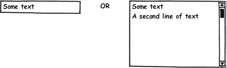

Элемент представления для отображения или редактирования неформатированного текста.

   

#### Sketch



   

#### Methods

|Name|Description|
|----|-----------|
|GetMultiline(): boolean|Возвращает значение, определяющее, разрешен ли многострочный текст.|
|SetMultiline(boolean value)|Устанавливает значение, определяющее, разрешен ли многострочный текст.|
| | |
|GetLineCount(): int|Возвращает видимое количество строк.|
|SetLineCount(int value)|Устанавливает видимое количество строк.|

   

#### Events

|Name|Description|
|----|-----------|
| | |

   

#### Schema  

```
{
  "id": "TextBox",
  "description": "Элемент представления для отображения или редактирования неформатированного текста",
  "type": "object",
  "extends": {
    "$ref": "http://demo.infinnity.ru:8081/display/MC/BaseTextElement"
  },
  "properties": {
    "Multiline": {
      "description": "Разрешен ли многострочный текст",
      "type": "boolean",
      "default": false
    },
    "LineCount": {
      "description": "Видимое количество строк",
      "type": "integer"
    }
  },
  "additionalProperties": false
}
```

  

#### Examples

```
{
  "Label": "Фамилия",
  "LabelFloating": true,
  "Value": {
    "PropertyBinding": {
      "DataSource": "MainDataSource",
      "Property": "LastName"
    }
  }
}
```

 

 

