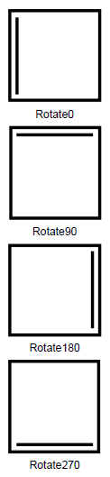

Поворот элемента печатного представления.

   

#### Type

enum

   

#### Description  

|Value|Description|
|-----|-----------|
|Rotate0|Без поворота.|
|Rotate90|Поворот на 90 по часовой стрелке.|
|Rotate180|Поворот на 180 по часовой стрелке.|
|Rotate270|Поворот на 270 по часовой стрелке.|

   

#### Schema

```
{
  "id": "PrintElementRotation",
  "description": "Поворот элемента печатного представления",
  "enum": [
    "Rotate0",
    "Rotate90",
    "Rotate180",
    "Rotate270"
  ]
}
```

    

#### Example



 

 

