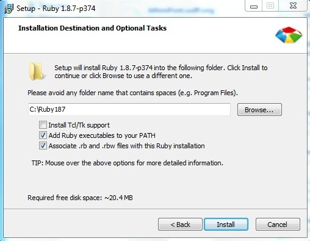

Для работы с проектом InfinniFront необходимо:

* установить Ruby;
* установить SASS;
* установить Sencha Ext JS;
* установить Grunt.

#### Установка Ruby

 ВАЖНО: если вы собираетесь устанавливать Sencha Ext JS, используете версию Ruby не выше 1.9.3.

 О процессе установки Ruby можно прочесть на сайте [Ruby](https://www.ruby-lang.org/en/downloads/). На мой взгляд, удобнее всего воспользоваться [установщиком](http://rubyinstaller.org/downloads/)[.](https://www.ruby-lang.org/en/downloads/)

#### Установка SASS

Обратите внимание: *для работы SASS необходимо установить Ruby!*

Если на вашем компьютере установлена Ruby, то можно приступать к установке [SASS](http://sass-lang.com/). Для этого необходимо запустить команду:

gem install sass

Либо вы можете установить SASS из репозитория Git, о чём можно прочесть на официальном сайте в разделе [download](http://sass-lang.com/download.html). 

Чтобы ознакомиться с возможностями SASS, рекомендую прочесть [справку](http://sass-lang.com/docs/yardoc/file.SASS_REFERENCE.html).

#### Установка Sencha Ext JS

Перед установкой рекомендую ознакомиться с [документацией](http://docs.sencha.com/extjs/4.2.1/#/guide/command). 

Для работы Sencha Ext JS необходима [Java Runtime Environment](http://www.oracle.com/technetwork/java/javase/downloads/jre7-downloads-1880261.html)  версии не ниже 1.6.

[Скачать Sencha](http://www.sencha.com/products/sencha-cmd/download).

Кроме того, для Sencha нужна[ Ruby не выше 1.9.3](https://www.ruby-lang.org/en/news/2012/06/29/ruby-1-8-7-p370-released/).

#### Установка Grunt

Установите [Node.js](http://nodejs.org/) .

Прочтите [инструкцию по установки Grunt](http://gruntjs.com/getting-started).

Запустите команду 

npm install -g grunt-cli 

 Для работы тестов установите 

npm install -g phantomjs

Далее в директории, в которой есть package.json(скорее всего, это InfinniFront\development),запустите 

npm install 

и он установить все пакеты, которые описаны в package.json и по правилам, которые там описаны (т.е. глобально или нет).

**Важно:** Чтобы проверить ваш код на соответствие стилю, запустите *grunt test *(не забывайте запускать эту команду хотя бы перед тем, как закоммититься!).

#### Загрузка библиотек

Зайдите в папку InfinniFront\development.

Установите bower  с помощью команды:

npm install bower -g

Далее команда

bower install

установит вам все необходимые библиотеки.

#### Запуск сервера

В директории InfinniFront\development запустите команду:

npm start

*Замечание:* по умолчанию используется порт 8080, если у вас он уже занят или вы просто хотите использовать другой порт, измените файл InfinniFront\development\server.js

