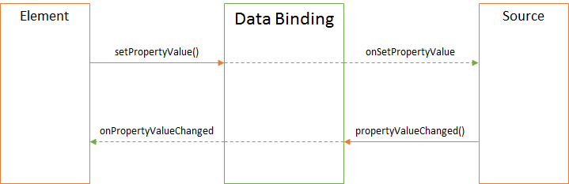

Привязка данных предназначена для описания связи между [элементами](../KeyConcepts/Element/)
[визуального представления](../KeyConcepts/View/) и данными. Иными словами, привязка данных обеспечивает
отражение визуального состояния на данные и наоборот. В роли источника данных привязки может выступать
[источник данных](../DataSources/), [параметр представления](../KeyConcepts/Parameter) или
[визуальный элемент](../KeyConcepts/Element/). 

Любая привязка данных представлена невизуальным программным объектом, каждый из которых предоставляет
[базовый API](BaseDataBinding/), обеспечивающий возможность различных
[типов обмена данными между элементом и источником](BaseDataBinding/BindingMode/):

* Двунаправленный обмен между элементом и источником (two way) - если в источнике произошли изменения,
элемент обновляется, и, наоборот, если изменения произошли в элементе, источник обновляется.
* Только обновление источника (to source) - если в источнике произошли изменения, элемент не обновляется,
но, если изменения произошли в элементе, источник обновляется.
* Только обновление элемента (to element) - если в источнике произошли изменения, элемент обновляется,
но, если изменения произошли в элементе, источник не обновляется.

Таким образом, привязка данных скрывает всю сложность синхронизации между элементом и источником,
что в значительной степени упрощает код и обеспечивает предсказуемость поведения всех элементов.

На данный момент выделено несколько типов привязок данных, покрывающих подавляющее количество задач
работы с данными на уровне визуального представления:

* [BaseDataBinding](BaseDataBinding/) - базовый тип для привязок данных.
* [ObjectBinding](ObjectBinding/) - привязка элемента и произвольного объекта.
* [PropertyBinding](PropertyBinding/) - привязка элемента и источника данных.
* [ParameterBinding](ParameterBinding/) - привязка элемента и параметра представления.
