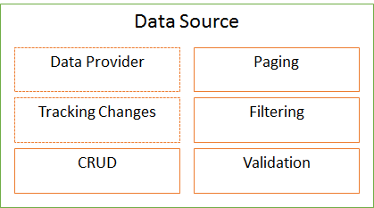

Каждое [визуальное представление](../KeyConcepts/View/), как правило, связано с какими-либо данными.
Для работы с данными на уровне визуального представления используются источники данных. Источник
данных - невизуальный программный объект, связанный с экземпляром визуального представления. Каждый
источник данных предоставляет [базовый API](BaseDataSource/), который может расширяться в зависимости
от типа источника. Источник данных реализует несколько взаимосвязанных аспектов:

* Инкапсуляция работы с поставщиком данных (Data Provider)
* Инкапсуляция отслеживания изменения данных (Tracking Changes)
* Создание, чтение, обновление, удаление данных (CRUD)
* Страничная навигация по данным (Paging)
* Фильтрация данных (Filtering)
* Проверка данных (Validation)

На данный момент выделено несколько типов источников данных, покрывающих подавляющее количество задач
работы с данными на уровне визуального представления:

* [`BaseDataSource`](BaseDataSource/) - базовый тип источников данных представления.
* [`ObjectDataSource`](ObjectDataSource/) - источник данных представления для произвольного массива данных.
* [`DocumentDataSource`](DocumentDataSource/) - источник данных представления для документов InfinniPlatform.
* [`MetadataDataSource`](MetadataDataSource/) - источник данных представления для метаданных InfinniPlatform.
