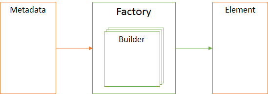

Фабрика элементов - программный объект, который предоставляет интерфейс для создания элементов любых
известных типов на основе их метаданных. Фабрика элементов создается при старте приложения и в ней
регистрируются все известные [построители элементов](Builder).

## Description

Интерпретация метаданных является ключевым аспектом клиентской части системы. Фабрика элементов
скрывает всю сложность этого процесса. Следует пояснить некоторые термины, о которых идет речь ниже.

* [Element](#element) - элемент - программный объект, с определенным интерфейсом (API), который позволяет запрашивать
и/или изменять внутреннее состояние (State) этого объекта. Под элементом в данном контексте может пониматься
как визуальный, так и невизуальный элемент. Все элементы по своему назначение делятся на типы, каждый
из которых описан в рамках данной спецификации. Для каждого типа элемента определен API и поведение,
а если это визуальный элемент, то и схема отображения (Sketch). Определенный для элементов API должен
быть реализован в строгом соответствии со спецификацией и является опорной точкой не только для написания
прикладных скриптов, но и при реализации механизма интерпретации метаданных.

* [Metadata](#metadata) - метаданные - описание свойств и/или поведения элемента. Для описания метаданных элементов
используется JSON-нотация. Метаданные элемента декларируют то, каким внутренним состоянием должен обладать
соответствующий элемент после того, как будет создан. Типы метаданных один к одному соответствуют типам
элементов и подробно описаны в рамках данной спецификации. Также следует отметить, что метаданные элемента
могут определять не только декларативные аспекты, но и императивные (например, обработчики событий).

* [Builder](#builder) - построитель - программный объект, позволяющий конструировать элементы определенного типа
на основе их метаданных. Иными словами, для каждого типа элемента (для каждого типа метаданных) должен
существовать свой построитель. Для конструирования соответствующего элемента построитель должен
использовать его API.



### Element

Каждый элемент реализует вполне определенный и задокументированный API, который позволяет запрашивать
и/или изменять внутреннее состояние элемента (State). Что в данном контексте понимается под
"внутренним состоянием элемента"? Скорей, это один или несколько приватных объектов элемента, доступ
к которым осуществляется через публичный API. Например, источник данных может иметь список загруженных
с сервера элементов, который вполне подходит под определение "внутреннего состояния". При фильтрации
данных или постраничной навигации этот список может изменяться. Что касается визуальных элементов, то
в качестве внутреннего состояния может выступать какой-либо визуальный компонент. Благодаря тому,
что доступ к внутреннему состоянию осуществляется через API, код, который работает с API (в частности,
код построителей элементов и код прикладных скриптов), совершенно не зависит от какой-то конкретной
программной библиотеки (например, от библиотеки визуальных компонентов).

### Metadata

Свойства и поведения элемента могут быть описаны с помощью метаданных. Каждому элементу соответствует
свой тип метаданных. Конечно, в целях унификации и упрощения метаданных элементов был использованы
определенные правила при наименовании свойств структур метаданных, поэтому близкие по смыслу или
назначению свойства у разных типов метаданных зачастую имеют одинаковое название. Более того, структура
метаданных во многом отражает API соответствующего элемента и наоборот. Но даже несмотря на эти правила
наименования, которые, безусловно, упрощают многие вещи, у каждого элемента все-таки свой набор свойств.
Следовательно, на уровне интерпретации метаданных возникает необходимость в определении типа элемента,
для которого осуществляется интерпретация метаданных. Это говорит о том, что метаданные должны хранить
не только информацию о элементе, но и информацию о типе элемента.

Для хранения информации о типе элемента был использован следующий достаточно универсальный принцип.
Метаданные элемента заворачиваются (wrap) в объект с одним единственным свойством, наименование
которого совпадает с наименованием типа метаданных элемента. Таким образом, получив подобную
обертку (wrapper), всегда можно извлечь информацию о типе метаданных и выбрать подходящий
построитель элемента. Конечно, информацию о типе можно было бы хранить в каком-нибудь специализированном
свойстве самого объекта метаданных, но в этом случае могут возникнуть определенные проблемы.
Во-первых, наименование этого специализированного свойства может конфликтовать с наименованием свойств
метаданных элемента. Во-вторых, информация о типе элемента не имеет прямого отношения к метаданным,
а относится к части реализации, связанной с их интерпретацией. В-третьих, подобные объекты нельзя
проиндексировать, поскольку разные типы метаданных будут иметь разные схемы. Наконец, идея
с оборачиванием (wrap) является наиболее естественной, если речь идет о JSON.

```js
{
	TypeName: {
		// Element Metadata
	}
}
```

Пример:

```js
{
	Button: {
		Text: 'Push me!'
	}
}
```

### Builder

Вышеприведенная иллюстрация и комментарии к ней поясняют суть всего решения. Центральным звеном всего
механизма в данном подходе являются построители элементов. Каждый из них реализует один и тот же программный
интерфейс, каждый из них занимается конструированием элементов определенного типа, наконец, каждый
из них никак не связан с другими построителями и ничего не знает о их существовании. Построитель
занимается интерпретацией метаданных элемента конкретного типа и, используя API этого элемента,
конструирует результирующий объект, таким образом скрывая всю сложность построения элемента заданного
типа. Такой подход позволят совершенно безболезненно расширять модель метаданных или изменять логику
построения какого-либо элемента, никак не затрагивая существующий функционал.

## Methods

[`register()`](Factory.register/)

Регистрирует построитель элементов.

[`build()`](Factory.build/)

Осуществляет создание элемента по его метаданным.

[`buildMany()`](Factory.buildMany/)

Осуществляет создание набора элементов по набору их метаданных.
