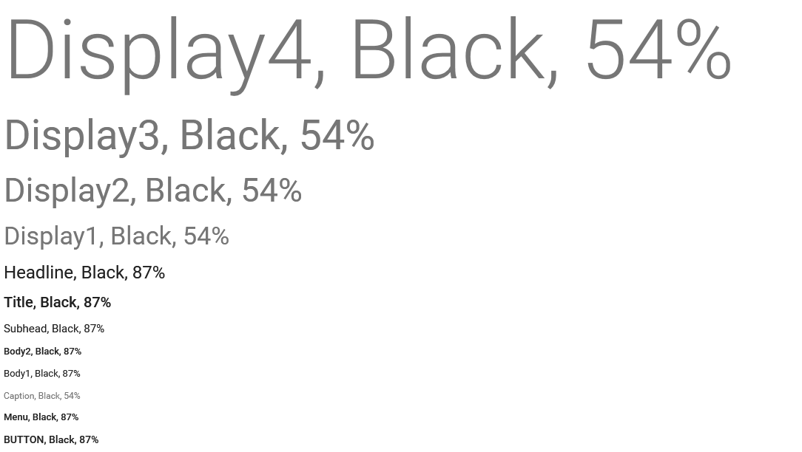
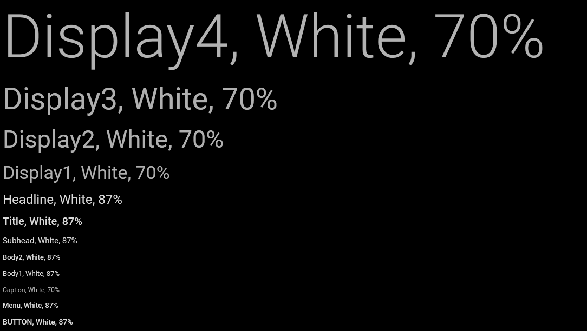

Стиль цвета.

# Description

Стиль цвета определяет цветовое оформление текста, визуального элемента или определенной части
визуального элемента. Стиль цвета определяет относительную величину, на основе которой с учетом
выбранной темы стилевого оформления и контекста использования будет вычислена абсолютная величина -
конкретный цвет. Этот цвет и будет применен к целевому объекту. Таким образом, за цветовую
согласованность интерфейса пользователя отвечает по большей части не разработчик, а система.

## Implementation

Цветовые стили включают в себя прозрачность (`transparent`), три основных цвета (`primary1`,
`primary2`, `primary3`), три акцентных цвета (`accent1`, `accent2`, `accent3`), белый (`white`)
и черный (`black`). При разработке визуальной темы рекомендуется выбрать три основных цвета из
одной палитры и один акцентный цвет из другой палитры. Тем не менее, не исключено, что могут
потребоваться дополнительные оттенки акцентного цвета.

Выбранные цвета должны хорошо смотреться по отдельности и вместе как на светлом, так и на темном
фоне. Обратите внимание на цветовой контраст. Например, если цвет текста будет иметь слабую
контрастность по отношению к цвету фона, пользователю будет трудно его увидеть. Самый простой
способ проверки контрастности выбранных цветов - посмотреть, как выглядит приложение на различных
устройствах при разных условиях освещения. Другой способ добиться нужного контраста - использовать
спецификацию [WCAG 2.0](http://www.w3.org/TR/WCAG20/#visual-audio-contrast-contrast) или любой
доступный online-калькулятор, который позволяет рассчитать соотношение контрастности цветов на
основе [яркости](http://en.wikipedia.org/wiki/Relative_luminance). При этом нужно учитывать, что
минимальный уровень контрастности составляет `4.5:1`, но предпочтительным является соотношение `7:1`.

## Text & Icons

Приоритетность или иерархичность текстовой или графической информации можно подчеркнуть не только с 
помощью [шрифта](../TextStyle), но и с помощью цвета. Для этого можно использовать различные оттенки
выбранных цветов, полученных с помощью регулировки [альфа-канала](http://en.wikipedia.org/wiki/Alpha_compositing).
Рекомендуемое значение альфа-канала для основной информации на белом фоне составляет `87%`; 
второстепенной информации, стоящий ниже в визуальной иерархии, `54%`; следующий уровень - `26%`;
и последний уровень - `12`%. (Обратите внимание, что приведенные цифры относятся только к белому фону,
для другого цвета фона нужно подбирать значение альфа-канала, ориентируясь на достаточный уровень
контрастности.)

## Using

Цветовое оформление улучшает взаимодействие, помогает обозначить интерактивные элементы, оживить
интерфейс, расставить дополнительные акценты и добиться визуальной целостности. Между тем цветом
следует пользоваться с особой осторожностью, как очень тонким инструментом. Не позволяйте цвету
отвлекать пользователя от содержимого и/или выполняемых действий. Не забывайте о пользователях
с цветовой слепотой (дальтонизмом), большинству из них трудно отличить красный от зеленого. С этой
точки зрения гораздо важней не сами цвета, а обеспечение достаточного уровня контрастности цветов. 

Для интерактивных элементов (кнопки, ссылки и т.п.) желательно выбрать один цвет, который будет
использоваться только для этих целей. Если цвет, используемый в интерактивных элементах, будет
использован в не интерактивном элементе, это может вызвать непонимание у пользователя. 

# Syntax

```js
ColorStyle = {
  transparent: 'Transparent',
  primary1: 'Primary1',
  primary2: 'Primary2',
  primary3: 'Primary3',
  accent1: 'Accent1',
  accent2: 'Accent2',
  accent3: 'Accent3',
  white: 'White',
  black: 'Black'
}
```

## Members

`transparent`

Прозрачный.

`primary1`

Основной цвет 1.

`primary2`

Основной цвет 2.

`primary3`

Основной цвет 3.

`accent1`

Акцентный цвет 1.

`accent2`

Акцентный цвет 2.

`accent3`

Акцентный цвет 3.

`white`

Белый.

`black`

Черный.

# Examples





# See Also

* [`TextStyle`](../TextStyle)
