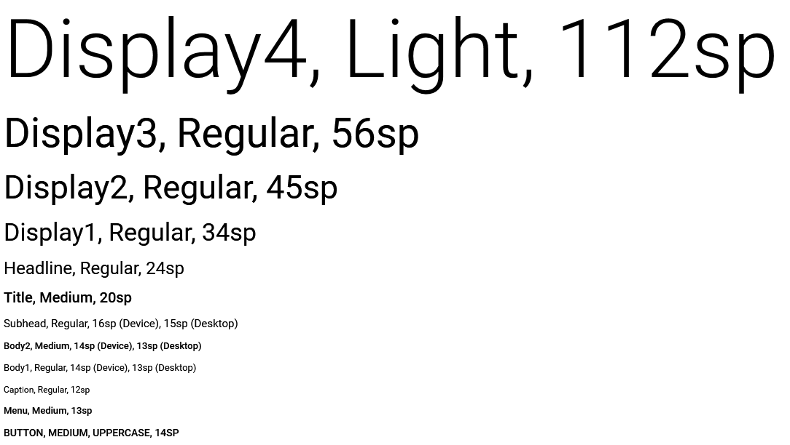

Стиль текста.

## Description

Стиль текста определяет шрифт (Font Family), размер (Font Size) и насыщенность (Font Weight)
выводимого на экран текста. Стиль текста определяет относительную величину, на основе которой
с учетом выбранной темы стилевого оформления и контекста использования будет вычислена абсолютная
величина - конкретные параметры шрифта. Эти настройки в конечном счете и будут применены к
выводимому тексту. Таким образом, за согласованность шрифтов интерфейса пользователя отвечает
по большей части не разработчик, а система.

## Implementation

Базовый набор стилей основан на типографической шкале с ограниченным набором размеров шрифта (12, 14,
16, 20 и 34), которые хорошо сочетаются друг с другом. Физические размеры шрифта должны определяется
в зависимости от разрешающей способности экрана (например, используя подход [Scale-Independent Pixels](http://developer.android.com/guide/topics/resources/more-resources.html#Dimension)).
Ниже приведены основные рекомендации для каждого из стилей.

|Name|Font Weigh|Font Size|
|----|----------|---------|
|Display4|Light|112sp|
|Display3|Regular|56sp|
|Display2|Regular|45sp|
|Display1|Regular|34sp|
|Headline|Regular|24sp|
|Title|Medium|20sp|
|Subhead|Regular|16sp (Device), 15sp (Desktop)|
|Body2|Medium|14sp (Device), 13sp (Desktop)|
|Body1|Regular|14sp (Device), 13sp (Desktop)|
|Caption|Regular|12sp|
|Menu|Medium|13sp|
|Button|Medium + Uppercase|14sp|

Также следует обратить внимание на следующие важные моменты. Ни в коем случае нельзя использовать
разные шрифты (Font Family). Все стили шрифта должны быть удобочитаемые (любой текст должен быть
разборчивыми). При создании стиля рекомендуется использовать насыщенность шрифта с уровнем Regular.
Крайне не рекомендуется использовать насыщенность шрифта с уровнем Bold, так как он является слишком
тяжелым.

## Using

Используя различные стили шрифта можно визуально расставлять акценты приоритетности содержания,
поскольку не все содержание одинаково важно для пользователя. В общем случае, выбирайте стиль с большим 
размером шрифта, если хотите увеличить приоритетность выводимой информации и/или обеспечить простоту
чтения. При этом не забывайте о балансе между размером шрифта и количеством выводимой информации. 
Большие размеры чаще всего используют при выводе коротких строк (названия, заголовки, подзаголовки и т.п.),
маленькие размеры используют для вывода дополнительной информации, представленной, как правило, 
строками большого размера (детальное описание, примечание и т.п.).

Поскольку текст выводится в рамках какой-то ограниченной области, то есть вероятность, что он будет 
представлен в виде нескольких строк. Если так, то нужно подобрать такой стиль, чтобы длина строки была 
комфортна для чтения. Согласно рекомендациям [Baymard Institute](http://baymard.com/blog/line-length-readability)
длина строки, удобная для чтения, составляет 50-60 символов. Слишком широкая текстовая колонка усложняет чтение, 
так как пользователю трудно переводить взгляд с конца одной строки на начало следующей. Слишком узкая 
текстовая колонка заставляет слишком часто переводить взгляд с конца одной строки на начало следующей, 
вследствие чего нарушается ритм чтения и усиливается напряжение. Усиление напряжения утомляет пользователя, 
он, недочитывая одну строку, переходит к следующей, следовательно, может не пропустить потенциально 
важную информацию.

# Syntax

```js
TextStyle = {
  display4: 'Display4',
  display3: 'Display3',
  display2: 'Display2',
  display1: 'Display1',
  headline: 'Headline',
  title: 'Title',
  subhead: 'Subhead',
  body2: 'Body2',
  body1: 'Body1',
  caption: 'Caption',
  menu: 'Menu',
  button: 'Button'
}
```

## Members

`display4`

Уровень шрифта "Display4".

`display3`

Уровень шрифта "Display3".

`display2`

Уровень шрифта "Display2".

`display1`

Уровень шрифта "Display1".

`headline`

Уровень шрифта "Headline".

`title`

Уровень шрифта "Title".

`subhead`

Уровень шрифта "Subhead".

`body2`

Уровень шрифта "Body2".

`body1`

Уровень шрифта "Body1".

`caption`

Уровень шрифта "Caption".

`menu`

Уровень шрифта "Menu".

`button`

Уровень шрифта "Button".

# Examples



# See Also

* [`ColorStyle`](../ColorStyle)
