#### Официальный сайт

[http://www.pentaho.com/](http://www.pentaho.com/)

#### Версия на момент написания статьи

5.0.1

 

#### Полная процедура создания отчета

 

Для работы с нестандартными источниками данных (и для интеграции систем) в Pentaho используется подход, общее название которого - ETL (от англ. Extract, Transform, Load). ETL-модуль в Pentaho представлен в виде визуальной утилиты с говорящим названием "Data Integration" (в народе ее называют "Spoon"). Это достаточно мощный инструмент, поэтому в контексте данной статьи он рассматривался исключительно с точки зрения решаемой задачи: возможность подключения источника данных, представленного в виде REST-сервиса. Для решения этой задачи нужно создать так называемый "Transformation". Transformation - это файл, в котором пользователь должен определить этапы: Extract (извлечение исходных данных из первичного источника), Transform (опционально; преобразование исходных данных в нужный формат), Load (опционально; загрузка преобразованных данных во вторичный источник). С помощью утилиты "Data Integration" все эти этапы задаются визуально, в виде диаграммы, которая очень сильно напоминает диаграмму потока данных. Преимуществом ETL-модуля от Pentaho в том, что он поддерживает достаточно много различных источников (input) и приемников (output), а также различных трансформаций данных. Например, из популярных nosql-хранилищ: Cassandra, MongoDB, CouchDb, HBase. В целом, для начала работы с данным инструментом этой информации более, чем достаточно, поэтому на данном этапе проще перейти к практике и рассмотреть способ решения вышеуказанной задачи.

  


Открываем "Data Integration", создаем "Transformation", в котором рисуем нижеследующую диаграмму. Все компоненты, присутствующие на этой диаграмме можно найти на панели "Design" с одноименным названием. Стрелки между компонентами (потоки данных) можно расставить с использованием меню, которое появляется при наведении на соответствующий блок. Собственно эта диаграмма задает последовательность шагов для выборки данных из REST-сервиса и преобразования этих данных в реляционный вид, с которым может работать дизайнер отчетов.

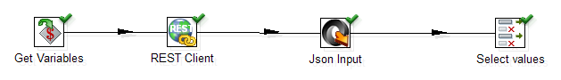

  


Далее рассмотрим настройки каждого блока. Блок "Get Variables" задает входные параметры для нашего data flow. В нашем случае - это только URL REST-сервиса, к которому производится обращение. Эти входные параметры будут переданы следующему блоку, с которым установлена связь через стрелку, то есть блоку "REST Client".

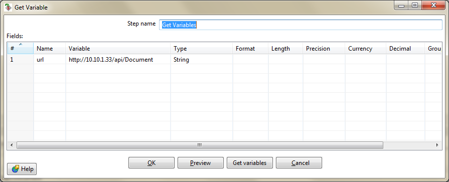  


  


В блоке "REST Client" определяются настройки HTTP-запроса к REST-сервису. URL сервиса берется из параметра "url", полученного на предыдущем шаге; HTTP-метод равен "GET"; а тип данных, который возвращает сервис равен "JSON". После того, как этот блок отработает, он запишет полученный JSON в выходной параметр "resultJson", который будет передан следующему блоку, с которым установлена связь через стрелку, то есть блоку "Json Input".

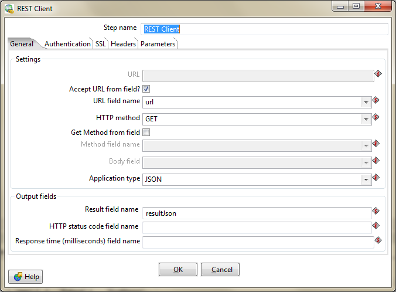

  


Блок "Json Input", по сути, задает объектно-реляционное преобразование, так как в нем определены правила того, как из исходного JSON-объекта получить результирующий набор полей (фактически колонок реляционной таблицы). Итак, на этом уровне в качестве источника JSON-файла указывается параметр "resultJson", значение которого было получено на предыдущем шаге. Далее на вкладке "Fields" осуществляется настройка объектно-реляционного преобразования с использованием синтаксиса [JSONPath](http://goessner.net/articles/JsonPath/).

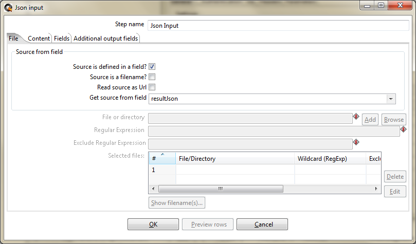  


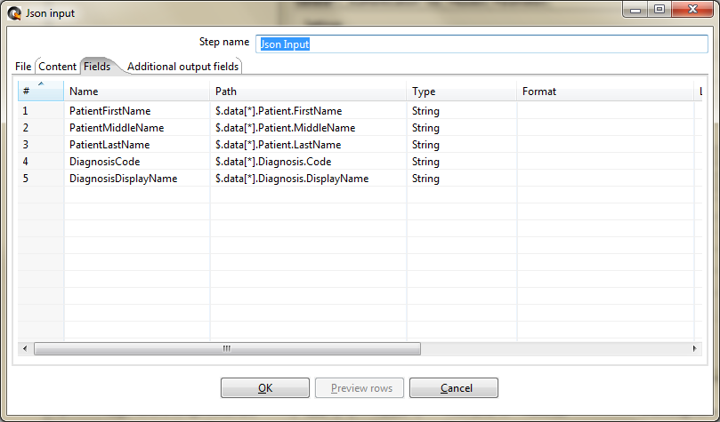  


 

Для задания правил объектно-реляционного преобразования, естественно, нужно знать схему исходного JSON-объекта. В качестве иллюстрации к данному примеру ниже приведена часть JSON-файла с данными.

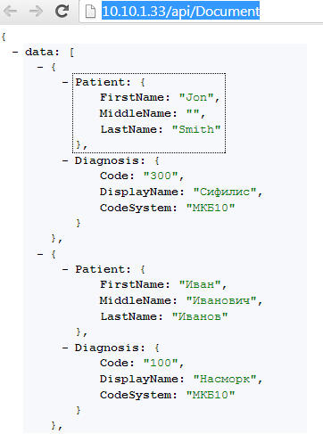

  


Наконец, блок "Select values" определяет последний шаг, где мы можем указать дополнительную мета-информацию выбранного поля (тип данных, размер, кодировку, правила форматирования и т.п.), а также исключить или добавить поля, которые попадут или не попадут в результирующий набор. В рамках данного примера в результирующий набор просто были включены все поля.

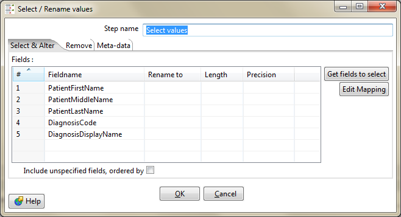  


  


Для проверки того, что трансформация работает правильно, нужно ее запустить (меню "Action / Run") и посмотреть на вкладку "Preview data". Если все нормально, данные будут выведены на экран, в противном случае будет выдано сообщение об ошибке, которое в 99% случаев совершенно не говорящее. В последнем случае приходится анализировать достаточно скупой вывод на вкладке "Logging", либо воспользоваться меню "Action / Verify".

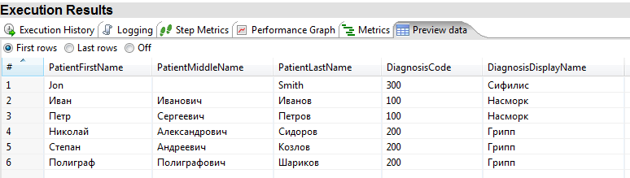  


На этом этапе все достаточно "стандартно", как и в любой отчетной системе. Запускаем "Report Designer", создаем новый отчет и начинаем верстку. Небольшая особенность заключена лишь в подключении источника данных, полученного на предыдущем этапе. Для этого нужно выбрать меню "Data / Add Datasource / Pentaho Data Integration". В появившемся диалоге добавить внешний источник данных, указав путь к файлу с описанием трансформации из предыдущего этапа, а также выбрать шаг трансформации, который будет являться источником данных для отчета (в нашем случае таким шагом является блок "Select values").

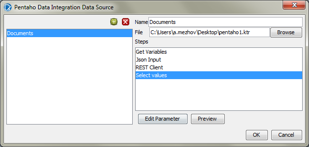

 

В итоге, на вкладке "Data" будет отображена структура источника данных.


 

После добавления источника начинается обычная верстка, результат которой может выглядеть следующим образом.

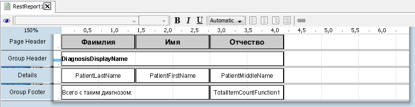

 

Для просмотра результата используется меню "View / Preview".

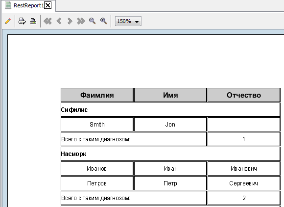

 

Предварительный просмотр **кэширует данные**, что может вызвать недоумение разработчика отчетов в случае, если он изменил данные в источнике, а в отчете они не отобразились. Для устранения этой проблемы следует делать очистку кэша через меню "Clear Data Cache".

 

 

На последнем шаге отчет публикуется на сервере для того, чтобы он стал виден пользователям. Эта процедура также осуществляется из "Report Designer" путем вызова меню "File / Publish...". В появившемся диалоге указывается URL сервера, куда осуществляется публикация и учетные данные пользователя. Pentaho имеет собственную подсистему безопасности, поэтому нужно указать учетную запись пользователя Pentaho.

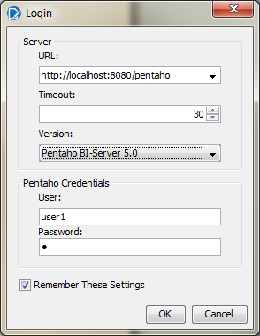

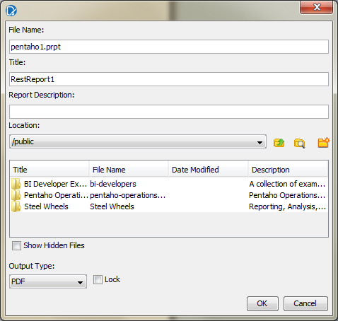

 

В итоге отчет будет доступен на сервере всем пользователям.

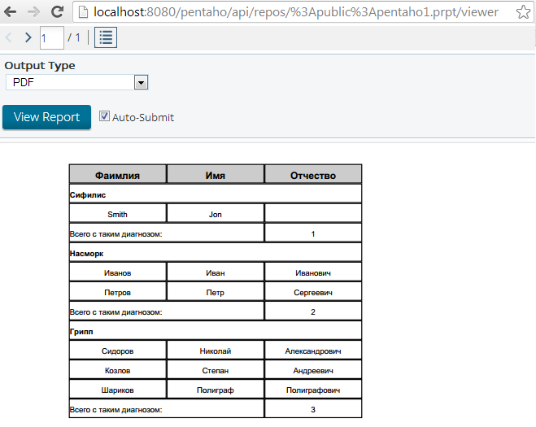

 

#### Явно выраженные недостатки и возможные проблемы

 

Во-первых, сразу после установки Pentaho возникли проблемы с кодировкой данных (поддержкой кириллицы). Для устранения этой проблемы в настройках "Data Integration" и "Report Designer" нужно явно указать UTF-8. Для этого нужно немного изменить bat/sh-файлы, с помощью которых запускаются данные утилиты.

```
if "%PENTAHO_DI_JAVA_OPTIONS%"=="" set PENTAHO_DI_JAVA_OPTIONS="-Xmx512m" "-XX:MaxPermSize=256m" "-Dfile.encoding=utf8"
```

```
set OPT="-XX:MaxPermSize=256m" "-Xmx512M" "-Dfile.encoding=utf8"
```

 

Во-вторых, наблюдались проблемы с конвертацией отчетов именно в PDF при использовании шрифтов по умолчанию. После того, как шрифт был изменен на "Arial" кириллица стала отображаться в PDF, но сам файл все равно открывается с нижеуказанной ошибкой, которая явно будет раздражать пользователя.

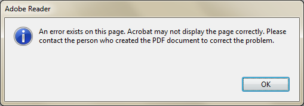

 

При этом в свойствах PDF-файла указано на автоопределение кодировки с использованием механизма "Identity-H", что, конечно, очень плохо, так как у конечного пользователя файл может быть отображен некорректно.

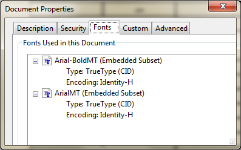

 

В-третьих, отталкиваясь от личного опыта разработки отчетов, мне показалось, что сам по себе "Report Designer" очень неудобен для верстки отчетов. Простые вещи требуют очень много "телодвижений". Сюда можно отнести и очень высокий порог вхождения в плане освоения имеющегося инструментария.

  


В-четвертых, в той версии, которую я рассматривал, отсутствовал компонент для построения матричных отчетов (cross-tab/matrix). Возможно, я его не увидел, возможно этот вид отчетов строится с использованием других средств (например, через OLAP-компонент), но точно знаю, что до версии 3.5 (включительно) у них не было поддержки матриц. Только по этой причине Pentaho можно вычеркнуть из списка кандидатов.

  


В-пятых, при использовании не реляционных источников данных (например, таких, как REST), верстальщику отчетов придется "вручную" настраивать объектно-реляционное преобразование ("Transformation"), например, так, как описано выше. Это очень утомительное и долгое занятие. Конечно, источников данных будет не так много, и можно использовать предопределенные трансформации, но все равно неприятно.

  


В-шестых, у Pentaho есть механизм автоматического кэширования данных, который срабатывает абсолютно для всех отчетов. Следовательно, построение отчетов типа "оперативный срез" становится проблематичным. Полагаю, что есть какие-то дополнительные настройки этого механизма (на уровне настроек "Transformation").

