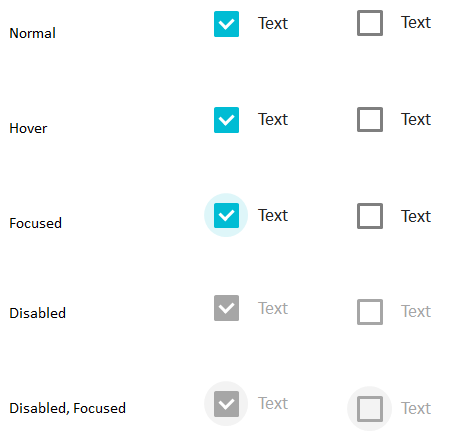

Элемент представления для отображения и редактирования логического значения в виде флажка. Может быть заменен элементом [[ToggleButton]].

   

#### Scketch



   

#### Methods

|Name|Description|
|----|-----------|
|GetValue(): boolean|Возвращает значение.|
|SetValue(boolean value)|Устанавливает значение.|

   

#### Events

|Name|Description|
|----|-----------|
|OnValueChanged([[Context]] context, [[DataSourceMessage]] argument)|Возвращает или устанавливает обработчик события изменения значения.|

   

#### Schema

```
{
  "id": "CheckBox",
  "description": "Элемент представления для отображения и редактирования логического значения в виде флажка",
  "type": "object",
  "extends": {
    "$ref": "http://demo.infinnity.ru:8081/display/MC/Element"
  },
  "properties": {
    "Value": {
      "description": "Привязка данных для значения",
      "$ref": "http://demo.infinnity.ru:8081/display/MC/DataBinding"
    },
    "OnValueChanged": {
      "description": "Обработчик события изменения значения",
      "$ref": "http://demo.infinnity.ru:8081/display/MC/LinkScript"
    }
  },
  "additionalProperties": false
}
```

   

#### Examples

```
{
  "Text": "Подписаться на новости",
  "Value": {
    "PropertyBinding": {
      "DataSource": "MainDataSource",
      "Property": "IsSubscribe"
    }
  }
}
```

 

 

