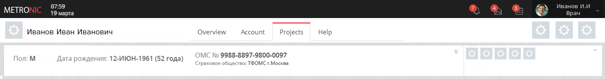
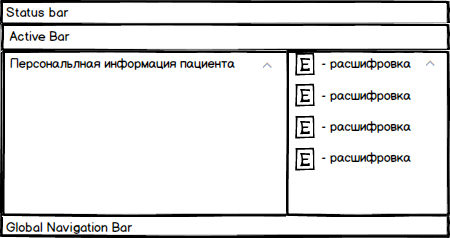
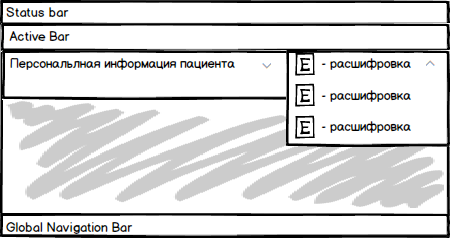

### Цель:

* Дать пользователю быстрый доступ ко всей необходимой информации по пациенту (журнал документов, персональная информация, анамнез, лист уточненных диагнозов, назначения и т.д.)
* Обратить внимание пользователя на важную\срочную информацию по пациенту
* Предоставить удобный интерфейс для работы
* Предоставить возможность редактировать пациента

 

ЭМК пациента – это отдельное приложение.

### Особенности:

Название приложения – ФИО пациентаИконка приложения – фото пациентаНа всех страницах приложения присутствует баннер пациентаГлавная страница – dashboard, который настраивается отдельно для каждой ролиБыстрые кнопки на Active Bar для главной страницы приложения ЭМК|Кнопка|Функция|
|Выйти из ЭМК|Приложение закрывается|

 

## Баннер пациента

Баннер пациента располагается сразу под Action Bar.

Баннер делится на 2 части:

Персональная информация пациентаСигнальная информацияСостояния баннера:

СвернутРазвернутРазвернута только сигнальная информация### Свернутое состояние баннера

#### Персональная информация:

№ картыПолДата рождения (возраст)Номер полиса ОМС (Компания)УчастокЛПУ прикрепленияЛьготаПредставитель#### Сигнальная информация:

Представлена в виде значков-иконок, при наведении на которые появляется всплывающая подсказка с более подробной информацией.

### Развернутое состояние баннера

В развернутом состоянии баннер занимает все пространство экрана.

#### Персональная информация:

Отображает всю заполненную информацию из документа Пациент в структурированном виде.

#### Сигнальная информация:

Сигнальная информация представлена в виде Иконка - Расшифровка

 Схема расположения развернутого баннера

### Состояние баннера, когда развернута только сигнальная информация

В данном состоянии персональная информация остается свернутой, а блок с сигнальной информацией раскрывается на необходимую длину.

Схема:

 

