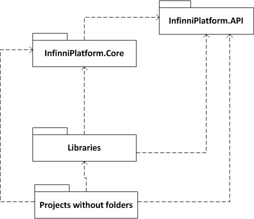
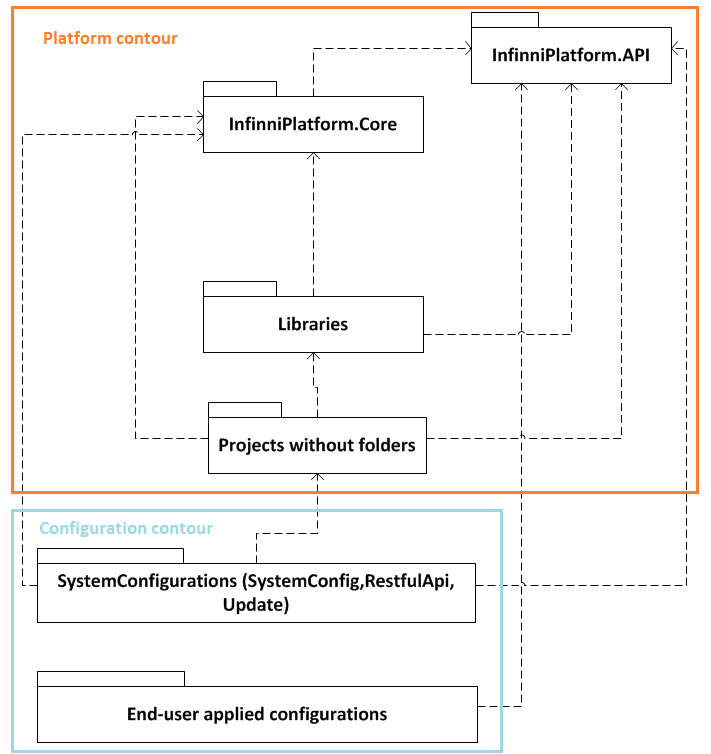

---
layout: default
title: Описание модульной архитектуры платформы.
position: 
categories: 
tags: 
---

Платформа поддерживает модульность на уровне проекта (.csproj - файл проекта Visual Studio 2012).

Структура проектов следующая:

На текущий момент платформа и конфигурации на базе ее реализованы полностью на основе .NET 4.5 с использованием языка C#.

В целом платформа на текущий момент разбита на два файла решений (Solution).

InfinniPlatform.slnInfinniConfiguration.slnСодержащиеся в решении InfinniPlatform.sln проекты относятся к системным модулям. Поддерживается следующая иерарахия взаимосвязей проектов в решении InfinniPlatform.sln:

Существует 4 отдельных папки, локализующих отдельные аспекты решения:

|Наименование папки|Проекты в составе|Предназначение|
|------------------|-----------------|--------------|
|Core|InfinniPlatform.CoreInfinniPlatform.API|Содержит сборки, реализующие самые базовые механизмы платформы.Сборка InfinniPlatform.API содержит механизмы, с помошью которых выполняется прикладная разработка. Данная сборка НЕ МОЖЕТ содержать ссылки на другие сборки из проектов InfinniPlatfom и InfinniConfigurationСборка InfinniPlatform.Core содержит базовые механизмы платформы, которые могут быть использованы ДРУГИМИ модулями платформы (исключая InfinniPlatfom.API). Сборка InfinniPlatform.Core НЕ может ссылаться на другие сборки из проектов InfinniPlatfom и InfinniConfiguration, за исключением проекта InfinniPlatfom.API, на который сборка InfinniPlatform.Core МОЖЕТ ссылаться.ЗАПРЕЩАЕТСЯ добавлять ссылки на другие сборки в проекты InfinniPlatform.Core и InfinniPlatfom.APIЗа счет полной независимости InfinniPlatfom.API от других сборок решения, для выполнения прикладной разработки достаточно предоставить клиенту только данную сборку/проект для предоставления возможности разработки клиентом собственных прикладных конфигураций. См. также Описание REST API системы.|
|Designer|Сборки проектов конфигуратора системы|Содержит сборки для реализации десктоп-конфигуратора конфигураций, реализуемых на базе платформы* Конфигуратор отчетов конфигурации
* Конфигуратор меню конфигурации
* Конфигуратор документов конфигурации
* Конфигуратор справочников конфигурации
* Конфигуратор визуальных представлений конфигурации
* Конфигуратор сценариев конфигурации
* Конфигуратор сервисов конфигурации
* Конфигуратор бизнес-процессов конфигурации
* Административная панель конфигурации

|
|Libraries|Список сборок, реализующих высокоуровневые абстракции над сторонними компонентами, используемыми в проекте InfinniPlatfom|Сборки, содержащиеся в папке Libraries могут ссылаться только на сборки из папки Core и ни на какие другие сборки из проектов InfinniPlatfom и InfinniConfiguration.Содержит список сборок со следующими высокоуровневыми абстракциями над сторонними компонентами:* InfinniPlatfom.Cassandra - абстракция для работы с БД Cassandra в рамках платформы
* InfinniPlatfom.CORS - абстракция для работы с Cross-Origin Resource Sharing
* InfinniPlatform.Index.ElasticSearch - абстракция для работы с движком ElasticSearch в рамках платформы
* InfinniPlatform.FastReport - абстракция для работы с движком отчетов FastReport
* InfinniPlatform.HealthLevelSeven - абстракция для работы с данными стандарта HL7
* InfinniPlatform.OceanInformatics - абстракция для генерации шаблонов OpenEHR на основе использования сторонней библиотеки Ocean
* InfinniPlatform.OWIN - абстракция на подходом OWIN к хостингу системы на основе Web API 2.0
* InfinniPlatform.RabbitMQ - абстракция над шиной сообщений RabbitMQ для работы с сообщениями в рамках платформы
* InfinniPlatform.SignalR - абстракция над системой рассылки Push-нотификаций SignalR
* InfinniPlatform.WebAPI - абстракция над движком .NET Web API 2.0

|
|Tests|Список проектов, в которых содержатся тесты различного типа (модульные, интеграционные, приемочные) для каждого из проектов InfinniPlatform|Каждому проекту, содержащемуся в любой папке InfinniPlatform необходимо создавать проект, содержащий тестыНапример: InfiniiPlatform.Core.csproj <=> InfinniPlatfom.Core.Tests.csproj|
|<В корне решения>|Помимо указанных выше, также существует подмножество проектов, находящихся вне папки. Данные проекты являются реализацией концепций, не зависящих от других сторонних компонентов, а только от других концепций платформы|Каждый проект в составе решения InfinniPlatform, не относящийся к какой-либо из папок, описанных выше, может ссылаться только на проекты из папки Core либо из папки Libraries. Например, проект InfinniPlatfom.Hosting ссылается на проекты* Папка Core  * InfinniPlatform.Core
  * InfinniPlatform.API

* Папка Libraries  * InfinniPlatform.OWIN - абстракция на подходом OWIN к хостингу системы на основе Web API 2.0
  * InfinniPlatfom.CORS - абстракция для работы с Cross-Origin Resource Sharing
  * InfinniPlatform.SignalR - абстракция над системой рассылки Push-нотификаций SignalR
  * InfinniPlatform.WebAPI - абстракция над движком .NET Web API 2.0

Таким образом, проект InfinniPlatform ссылается только на абстракции над сторонними библиотеками, но не на сами библиотеки, что позволяет иметь потенциальную возможность замены какого-либо из перечисленных компонентов.|

Таким образом, для поддержания модульной независимости системы используется следующая схема зависимостей:

Можно четко выделить три уровня зависимостей системы.

* 0 Уровень. Не зависит ни от чего вообще (кроме .NET нативных сборок): InfinniPlatform.API
* 1 Уровень. Зависит только от InfinniPlatform.API: InfinniPlatform.Core
* 2 Уровень. Зависит от сборок 0 уровня и сборок 1 уровня

Вышесказанное касается решения InfinniPlatform. В данном решении находятся только проекты, реализующие системную часть платформы.

Для решения InfinniConfiguration в данный момент структура папок не является настолько же жесткой

|Наименование папки|Проекты в составе|Предназначение|
|------------------|-----------------|--------------|
|Platform|Часть проектов решения InfinniPlatform|В настоящее время существует часть legacy проектов (ФИЭМК, конвертер CDA) и тестов, напрямую обращающаяся к абстракциям платформы, что в дальнейшем необходимо устранить путем перехода на JSON настройки конфигураций для всех проектов.Помимо этого, существуют системные конфигурации, которые поставляются as is и которым разрешается обращаться к сборкам платформы. Эти конфигурации разрабатываются только разработчиками компании Infinnity Solutions в рамках модернизации ядра платформы и поставляются клиентам без возможности модернизации.Все вновь создаваемые проекты прикланых конфигураций должны содержать ссылку только на проект InfinniPlatfom.API и больше ни на какие проекты из решений InfinniPlatform и InfinniConfiguration|
|Tests|Содержит проекты с тестами каждой конфигурации (модульными, интеграционными, приемочными)|Все проекты прикладных конфигураций должны иметь соответствующий проект с тестами, заканчивающийся .Tests)|
|<В корне проекта>|Содержит модули (проекты csproj) прикладных конфигураций|Существуют системные конфигурации, которые поставляются as is и которым разрешается обращаться к сборкам платформы. Эти конфигурации разрабатываются только разработчиками компании Infinnity Solutions в рамках модернизации ядра платформы и поставляются клиентам без возможности модернизации. К таким конфигурациям относятся:* InfinniConfiguration.RestfulAPI - предоставляет операции низкоуровневого доступа к объектам платформы  * Запись любого документа JSON в индекс (строго через использовании абстракции над ElasticSearch)
  * Поиск любого документа JSON в индексе(строго через использовании абстракции над ElasticSearch)
  * Административные операции с индексом (строго через использовании абстракции над ElasticSearch)
  * Запись любого документа в Cassandra (строго через использовании абстракции над Cassandra)
  * Поиск любого документа в Cassandra (строго через использовании абстракции над Cassandra)
  * итд... Подробнее

* InfinniConfiguration.SystemConfig - предоставляет операции высокоуровневого доступа к объектам данных и метаданных прикладных конфигураций. Использует низкоуровневые операции RestAPI для доступа. Подробнее
* InfinniConfiguration.Update - конфигурация, выполняющая административные операции и операции обновления прикладных конфигураций

Данные конфигурации могут ссылаться на любые сборки из решения InfinniPlatform и не могут ссылаться ни на какие сборки из решения InfinniConfiguration (не могут ссылаться на другие прикладные конфигурации).Остальные прикладные конфигурации, не относящиеся к трем вышеуказанным могут ссылаться только на сборку InfinniPlatform.API|

С учетом вышесказанного, схема, приведенная выше, преобразуется следующим образом:

 

 

