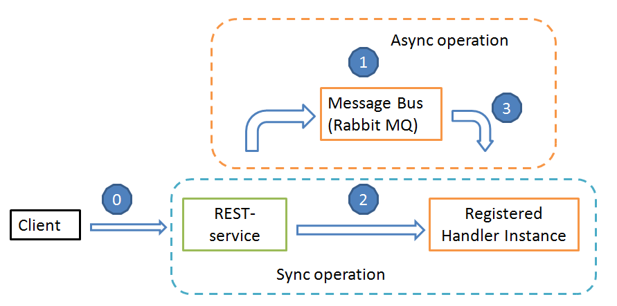
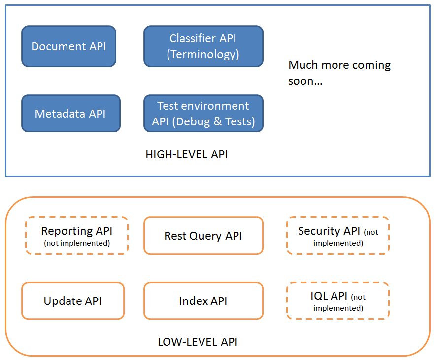

Поскольку система в целом имеет композитную структуру, необходимы способы интеграции между различными ее модулями.

При этом нельзя, чтобы возникала связанность между отдельными модулями системы.

Существует 2 возможных способа межмодульной интеграции:

Интеграция на основе передачи сообщений в шину с последующим использованием потребителями информации из шины (асинхронный подход)Интеграция на основе вызовов сервисов, реализующих заранее известный API системы (синхронный подход)Оба подхода в рамках платформы могут быть сведены к единому. Схема реализации взаимодействия клиента и сервера имеет следующий вид:

 

|№п/п|Описание этапа|
|----|--------------|
|0|Клиент отправляет веб-запрос вида  http://10.10.1.223:9999/ClassifierLoader/StandardApi/classifiers/PublishНа этом этапе выполняется роутинг запроса на соответствующий контроллер сервиса REST. О роутинге запросов к платформе см. здесь|
|1|Если сервис платформы задекларирован с указанием асинхронной обработки, создается новое сообщение в шине сообщений (Async operation контур), которое ждет своей очереди на обработку|
|2|Если сервис платформы задекларирован с указанием синхронной обработки, следует непосредственный вызов зарегистрированного обработчика для роутинга запроса. Об обработчиках подробнее см. [[здесь|Декларативное описание сервисов платформы]]|
|3|После достижения своей очереди, запрос из шины попадает на обработку в зарегистрированном обработчике роутинга. Об обработчиках подробнее см. [[здесь|Декларативное описание сервисов платформы]]|

В данный момент контур асинхронной обработки данных еще ***не реализован*** по следующим причинам:

* Асинхронная обработка пригодна для ограниченного круга сценариев, где допустима отложенная нотификация пользователя о результатах обработки
* В данный момент не реализована сервисная обертка вокруг реализаций push-нотификаций и шины сообщений (сервисная обертка представляет собой скриптовые обработчики на уровнее системных конфигураций. [[Подробнее о скриптовых обработчиках|Точки расширения бизнес-логики]].)
* Асинхронная обработка является последним шансом на спасение, поэтому ее стоит использовать, только если не помогли другие методы оптимизации обработки данных, такие как масштабирование систем хранения данных и системы хостинга запросов
* Синхронная обработка на данный момент обеспечивает удовлетворительное время ответа

Тем не менее, учитывая, что абстракции вокруг SignalR и RabbitMQ полностью реализованы, можно прогнозировать возможность подключения этих модулей к системе в кратчайшие сроки.

На рассмотренном выше изображании Client может являться как фронтендом системы, так и другим модулем платформы. Таким образом, все модули платформы могут обмениваться между собой сообщениями как в синхронном, так и в асинхронном режиме.

Все существующие в системе модули API могут быть вызваны описанным выше образом.

Существует два уровня прикладного API, описанного в сборке InfinniPlatform.API. Все прикладные сборки, в том числе тестовые, могут использовать данный API для выполнения необходимых операций. Непосредственное обращение из [[скриптов|Точки расширения бизнес-логики]] прикладных сборок к C# объектам, реализующим обработку, не допускается (запрещено непосредственное создание и вызов объектов платформы).

|Тип API|Содержание|
|-------|----------|
|Low-level API|Содержит низкоуровневые операции для работы с хранилищем данных, для выполнения запросов IQL, для вызова сервисов REST в оговоренном формате обмена сообщениями, для вызова операций обновления прикладных конфигураций|
|High-level API|Содержит высокоуровневые абстракции для работы на уровне предметной области (работа с документами, терминологией, метаданными прикладных конфигураций). В дальнейшем планируется расширение высокоуровневого API платформы|

Примеры вызова данных API можно найти в проекте InfinniPlatform.Tests.csproj, а также в данной документации

 

