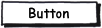

---
layout: default
title: Button
position: 3
categories: 
tags: 
---

Элемент представления в виде кнопки.

 



 

|Name|Description|
|----|-----------|
|GetImage(): string|Возвращает изображение кнопки.|
|SetImage(string value)|Устанавливает изображение кнопки.|
|GetAction(): [[Action]]|Возвращает действие при нажатии на кнопку.|
|SetAction([[Action]] value)|Устанавливает действие при нажатии на кнопку.|
|Click()|Осуществляет программное нажатие на кнопку.|

|Name|Description|
|----|-----------|
|OnClick|Возвращает или устанавливает обработчик события нажатия на кнопку.|

  

```
{
	"id": "Button",
	"description": "Элемент представления в виде кнопки",
	"type": "object",
	"extends": {
		"$ref": "http://demo.infinnity.ru:8081/display/MC/Element"
	},
	"properties": {
		"Image": {
			"description": "Изображение кнопки",
			"type": "string"
		},
		"Action": {
			"description": "Действие при нажатии на кнопку",
			"$ref": "http://demo.infinnity.ru:8081/display/MC/Action"
		},
		"OnClick": {
			"description": "Обработчик события нажатия на кнопку",
			"$ref": "http://demo.infinnity.ru:8081/display/MC/LinkScript"
		}
	}
}
```

```
{
	"Name": "Button1",
	"Text": "Сохранить",
	"Image": "Save"
}
```

 

 

