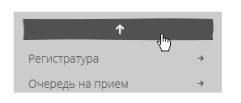
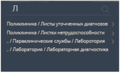
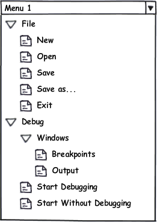

---
layout: default
title: MenuBar
position: 1
categories: 
tags: 
---

Элемент представления в виде иерархического меню.

При загрузке данного элемента представления происходит обращение к серверу, который возвращает список доступных меню ([[Menu]]) для данного пользователя. При обращении к серверу указывается идентификатор конфигурации (ConfigId), определенный в метаданных элемента. Сервер, получив запрос на предоставление списка доступных меню, производит поиск меню в указанной конфигурации с учетом прав текущего пользователя. В итоге, если пользователю не доступно ни одного меню, данный элемент представления не отображается; если пользователю доступно несколько меню (более одного), выбирается меню, соответствующее текущей активной роли пользователя.

  

Визуально меню должно быть вертикальным, иерархическим. Раскрытие и сворачивание элементов меню должно осуществляться по клику мышки. Также должна быть реализована поддержка клавиатурной навигации. Элементы меню, содержащие подпункты должны визуально отличаться от конечных элементов меню. Если меню не помещается в размеры экрана, должны появляться стрелки для прокрутки, например, так, как показано на рисунке ниже.   



  


Помимо этого должна существовать возможность осуществлять полнотекстовый поиск по элементам меню. Строка поиска находится над меню первого уровня. После того, как пользователь начинает вводить название пункта меню в поиск, список меню заменяется списком путей, в которых присутствуют искомые разделы. Если отфильтрованный пункт меню не является последним в иерархии, то при нажатии на него, открывается полноценное меню с уже выбранным необходимым разделом.

  


  


Схематичный вид меню приведен на рисунке ниже.   



 

|Name|Description|
|----|-----------|
| | |

|Name|Description|
|----|-----------|
| | |

   

```
{
	"id": "MenuBar",
	"description": "Элемент представления в виде иерархического меню",
	"type": "object",
	"extends": {
		"$ref": "http://demo.infinnity.ru:8081/display/MC/Element"
	},
	"properties": {
		"ConfigId": {
			"description": "Идентификатор конфигурации",
			"type": "string",
			"required": true
		}
	}
}
```

```
{
	"Name": "MenuBar1",
	"ConfigId": "Integration"
} 
```

  


 

