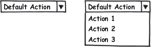

---
layout: default
title: PopupButton
position: 4
categories: 
tags: 
---

Элемент представления в виде кнопки со всплывающим окном.

 



 

|Name|Description|
|----|-----------|
|GetImage(): string|Возвращает изображение кнопки.|
|SetImage(string value)|Устанавливает изображение кнопки.|
|GetAction(): [[Action]]|Возвращает действие при нажатии на кнопку.|
|SetAction([[Action]] value)|Устанавливает действие при нажатии на кнопку.|
|Click()|Осуществляет программное нажатие на кнопку.|
|AddItem([[Element]] item)|Добавляет элемент во всплывающее окно.|
|RemoveItem([[Element]]  item)|Удаляет элемент из всплывающего окна.|
|GetItem(string name): [[Element]]|Возвращает элемент всплывающего окна по имени.|
|GetItems(): array<[[Element]]>|Возвращает элементы всплывающего окна.|

|Name|Description|
|----|-----------|
|OnClick|Возвращает или устанавливает обработчик события нажатия на кнопку.|

  

```
{
	"id": "PopupButton",
	"description": "Элемент представления в виде кнопки со всплывающим окном",
	"type": "object",
	"extends": {
		"$ref": "http://demo.infinnity.ru:8081/display/MC/Button"
	},
	"properties": {
		"Items": {
			"description": "Список элементов всплывающего окна",
			"type": "array",
			"items": {
				"$ref": "http://demo.infinnity.ru:8081/display/MC/ActionElement"
			}
		}
	}
}
```

```
{
	"Name": "PopupButton1",
	"Text": "Добавить",
	"Items": [
		{
			"Button": {
				"Name": "Button1",
				"Text": "Группу"
			}
		},
		{
			"Button": {
				"Name": "Button2",
				"Text": "Пользователя"
			}
		}
	]
}
```

 

 

