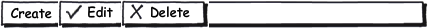

Элемент представления в виде панели инструментов.

  


  


 

|Name|Description|
|----|-----------|
|AddItem([[ToolBarItem]] item)|Добавляет элемент в список.|
|RemoveItem([[ToolBarItem]] item)|Удаляет элемент из списка.|
|GetItem(string name):|Возвращает элемент по имени.|
|GetItems(): array<[[ToolBarItem]]>|Возвращает список элементов.|

|Name|Description|
|----|-----------|
| | |

   

```
{
	"id": "ToolBar",
	"description": "Элемент представления в виде панели инструментов",
	"type": "object",
	"extends": {
		"$ref": "http://demo.infinnity.ru:8081/display/MC/Element"
	},
	"properties": {
		"Items": {
			"description": "Список элементов панели инструментов",
			"type": "array",
			"items": {
				"$ref": "http://demo.infinnity.ru:8081/display/MC/ToolBarItem"
			}
		}
	}
}
```

```
{
	"Name": "ToolBar1",
	"Items": [
		{
			"ToolBarButton": {
				"Name": "ToolBarButton1",
				"Text": "Создать"
			}
		},
		{
			"ToolBarButton": {
				"Name": "ToolBarButton2",
				"Text": "Изменить"
			}
		},
		{
			"ToolBarSeparator": {
				"Name": "ToolBarSeparator1"
			}
		},
		{
			"ToolBarButton": {
				"Name": "ToolBarButton3",
				"Text": "Удалить"
			}
		}
	]
}
```

  


 

