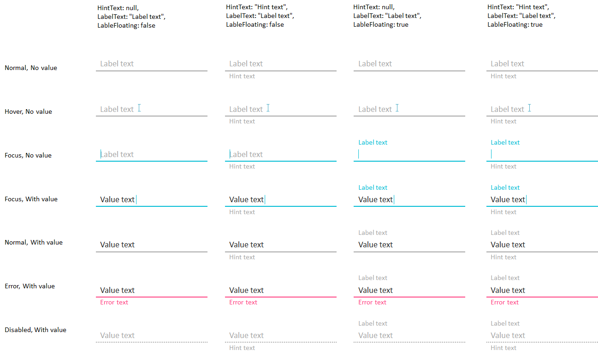

Элемент представления для отображения или редактирования неформатированного текста.

   

#### Sketch

  


   

#### Methods

 

|Name|Description|
|----|-----------|
|GetHorizontalTextAlignment(): [[HorizontalTextAlignment]]|Возвращает горизонтальное выравнивание текста внутри элемента.|
|SetHorizontalTextAlignment([[HorizontalTextAlignment]] value)|Устанавливает горизонтальное выравнивание текста внутри элемента.|
| | |
|GetVerticalTextAlignment(): [[VerticalTextAlignment]]|Возвращает вертикальное выравнивание текста внутри элемента.|
|SetVerticalTextAlignment([[VerticalTextAlignment]] value)|Устанавливает вертикальное выравнивание текста внутри элемента.|
| | |
|GetForeground(): [[TextStyle]]|Возвращает цвет текста.|
|SetForeground([[TextStyle]] value)|Устанавливает цвет текста.|
| | |
|GetBackground(): [[TextStyle]]|Возвращает цвет фона.|
|SetBackground([[TextStyle]] value)|Устанавливает цвет фона.|
| | |
|GetTextStyle(): [[TextStyle]]|Возвращает стиль текста.|
|SetTextStyle([[TextStyle]] value)|Устанавливает стиль текста.|
| | |
|GetDisplayFormat(): [[BaseFormat]]|Возвращает формат отображения значения.|
|SetDisplayFormat([[BaseFormat]] value)|Устанавливает формат отображения значения.|
| | |
|GetEditMask(): [[BaseEditMask]]|Возвращает маску ввода значения.|
|SetEditMask([[BaseEditMask]] value)|Устанавливает маску ввода значения.|
| | |
|GetValue(): any|Возвращает значение.|
|SetValue(any value)|Устанавливает значение.|
| | |
|GetHintText(): string|Возвращает текст подсказки для ввода значения.|
|SetHintText(string value)|Устанавливает текст подсказки для ввода значения.|
| | |
|GetErrorText(): string|Возвращает текст ошибки введенного значения.|
|SetErrorText(string value)|Устанавливает текст ошибки введенного значения.|
| | |
|GetLabelText(): string|Возвращает текст метки введенного значения.|
|SetLabelText(string value)|Устанавливает текст метки введенного значения.|
| | |
|GetLabelFloating(): boolean|Возвращает значение, определяющее, является ли метка введенного значения плавающей.|
|SetLabelFloating(boolean value)|Устанавливает значение, определяющее, является ли метка введенного значения плавающей.|

    

#### Events

 

|Name|Description|
|----|-----------|
|OnValueChanged([[Context]] context, [[DataSourceMessage]] argument)|Возвращает или устанавливает обработчик события изменения значения.|

   

#### Schema

```
{
  "id": "BaseTextElement",
  "description": "Элемент представления для отображения или редактирования неформатированного текста",
  "type": "object",
  "extends": {
    "$ref": "http://demo.infinnity.ru:8081/display/MC/Element"
  },
  "properties": {
    "HorizontalTextAlignment": {
      "description": "Горизонтальное выравнивание текста внутри элемента",
      "$ref": "http://demo.infinnity.ru:8081/display/MC/HorizontalTextAlignment",
      "default": "Left"
    },
    "VerticalTextAlignment": {
      "description": "Вертикальное выравнивание текста внутри элемента",
      "$ref": "http://demo.infinnity.ru:8081/display/MC/VerticalTextAlignment",
      "default": "Center"
    },
    "Foreground": {
      "description": "Цвет текста",
      "$ref": "http://demo.infinnity.ru:8081/display/MC/ColorStyle",
      "default": "Black"
    },
    "Background": {
      "description": "Цвет фона",
      "$ref": "http://demo.infinnity.ru:8081/display/MC/ColorStyle",
      "default": "Transparent"
    },
    "TextStyle": {
      "description": "Стиль текста",
      "$ref": "http://demo.infinnity.ru:8081/display/MC/TextStyle",
      "default": "Body1"
    },
    "DisplayFormat": {
      "description": "Формат отображения значения",
      "$ref": "http://demo.infinnity.ru:8081/display/MC/DisplayFormat"
    },
    "EditMask": {
      "description": "Маска ввода значения",
      "$ref": "http://demo.infinnity.ru:8081/display/MC/EditMask"
    },
    "Value": {
      "description": "Привязка данных для значения",
      "$ref": "http://demo.infinnity.ru:8081/display/MC/DataBinding"
    },
    "HintText": {
      "description": "Текст подсказки для ввода значения",
      "type": "string"
    },
    "ErrorText": {
      "description": "Текст ошибки введенного значения",
      "type": "string"
    },
    "LabelText": {
      "description": "Текст метки введенного значения",
      "type": "string"
    },
    "LabelFloating": {
      "description": "Является ли метка введенного значения плавающей",
      "type": "boolean",
      "default": false
    },
    "OnValueChanged": {
      "description": "Обработчик события изменения значения",
      "$ref": "http://demo.infinnity.ru:8081/display/MC/LinkScript"
    }
  }
}
```

   

#### Links

[[TextBox]]

[[NumericBox]]

[[DatePicker]]

 

 

