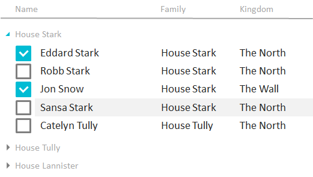

Группа таблицы.

   

#### Sketch

   

   

#### Methods

|Name|Description|
|----|-----------|
|GetValueProperty(): string|Возвращает свойство элемента источника данных, которое используется для группировки.|
|SetValueProperty(string value)|Устанавливает свойство элемента источника данных, которое используется для группировки.|

   

#### Events

|Name|Description|
|----|-----------|
| | |

   

#### Schema

```
{
  "id": "DataGridGroup",
  "description": "Группа таблицы",
  "type": "object",
  "properties": {
    "Name": {
      "description": "Наименование группы",
      "type": "string"
    },
    "ValueProperty": {
      "description": "Свойство элемента источника данных, которое используется для группировки",
      "type": "string",
      "required": true
    }
  }
}
```

   

#### Examples

```
{
  "ValueProperty": "Country"
}
```

 

 

