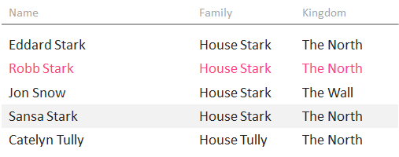
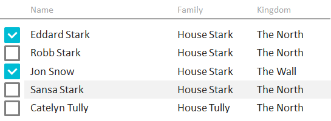

Элемент представления для отображения данных в виде таблицы.

Элемент может работать в двух режимах: выбор одного значения, выбор нескольких значений (см. рис.).

    

#### Sketch

    


   

#### Methods

|Name|Description|
|----|-----------|
|AddColumn([[DataGridColumn]] value)|Добавляет колонку таблицы.|
|RemoveColumn([[DataGridColumn]] value)|Удаляет колонку таблицы.|
|GetColumn(string name): [[DataGridColumn]]|Возвращает колонку таблицы по имени.|
|GetColumns(): array<[[DataGridColumn]]>|Возвращает список колонок таблицы.|
| | |
|AddGroup([[DataGridGroup]] value)|Добавляет группу таблицы.|
|RemoveGroup([[DataGridGroup]] value)|Удаляет группу таблицы.|
|GetGroup(string name): [[DataGridGroup]]|Возвращает группу таблицы по имени.|
|GetGroups(): array<[[DataGridColumn]]>|Возвращает список групп таблицы.|

   

#### Events

|Name|Description|
|----|-----------|
| | |

   

#### Schema    

```
{
  "id": "DataGrid",
  "description": "Элемент представления ля отображения данных в виде таблицы",
  "type": "object",
  "extends": {
    "$ref": "http://demo.infinnity.ru:8081/display/MC/BaseListElement"
  },
  "properties": {
    "Columns": {
      "description": "Список колонок таблицы",
      "type": "array",
      "items": {
        "$ref": "http://demo.infinnity.ru:8081/display/MC/DataGridColumn"
      }
    },
    "Groups": {
      "description": "Список групп таблицы",
      "type": "array",
      "items": {
        "$ref": "http://demo.infinnity.ru:8081/display/MC/DataGridGroup"
      }
    }
  }
}
```

   

#### Examples

```
{
  "Columns": [
    {
      "Text": "Фамилия",
      "DisplayProperty": "LastName"
    },
    {
      "Text": "Имя",
      "DisplayProperty": "FirstName"
    },
    {
      "Text": "Отчество",
      "DisplayProperty": "MiddleName"
    }
  ],
  "Groups": [
    {
      "ValueProperty": "Country"
    },
    {
      "ValueProperty": "City"
    }
  ],
  "Items": {
    "PropertyBinding": {
      "DataSource": "PatientsDataSource"
    }
  }
}
```

 

 

