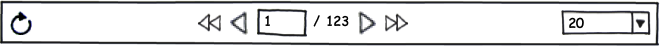

Элемент представления для панели навигации по данным.

 



 

Панель навигации содержит следующие элементы управления:

* Кнопку "Обновить"
* Кнопку "На первую страницу"
* Кнопку "На предыдущую страницу"
* Редактируемое поле "Номер текущей страницы"
* Статическое поле "Количество страниц"
* Кнопку "На следующую страницу"
* Кнопку "На последнюю страницу"
* Выпадающий список "Количество элементов на странице"

 

Кнопка "Обновить" запрашивает у источника обновление данных на текущей странице. Кнопка "На первую страницу" запрашивает у источника первую страницу и устанавливает в поле "Номер текущей страницы" значение "1". Кнопка "На предыдущую страницу" запрашивает у источника предыдущую страницу и устанавливает в поле "Номер текущей страницы" значение, меньшее на единицу. Если номер текущей страницы равен 1, то нажатие на кнопку "На предыдущую страницу" ни к чему не приводит. Редактируемое поле "Номер текущей страницы" позволяет пользователю сразу перейти на нужную страницу; после ввода номера желаемой страницы осуществляется запрос к источнику. Статическое поле "Количество страниц" отображает доступное количество страниц. Если количество страниц не известно, в данном поле отображается текст "/ ?". Кнопка "На следующую страницу" запрашивает у источника следующую страницу и устанавливает в поле "Номер текущей страницы" значение, большее на единицу. Если количество страниц известно и номер текущей страницы равен количеству страниц, то нажатие на кнопку "Но следующую страницу" ни к чему не приводит. Кнопка "На последнюю страницу" запрашивает у источника последнюю страницу и устанавливает в поле "Номер текущей страницы" значение, равное номеру последней страницы. Если количество страниц не известно, то нажатие на кнопку "На последнюю страницу" ни к чему не приводит. Выпадающий список "Количество элементов на странице" отображает отсортированный по возрастанию список с доступными размерами страницы и позволяет управлять количеством элементов, отображаемых на странице. При выборе из этого списка нового значения, у источника запрашивается первая страница с заданным количеством элементов, а в поле "Номер текущей страницы" устанавливается значение "1". Если доступные для выбора размеры страниц не заданы, то выпадающий список "Количество элементов на странице" не отображается, а размер страницы по умолчанию определяется самим источником. Если доступные для выбора размеры страниц заданы, то размер страницы по умолчанию определяется самым первым размером в списке.

|Name|Description|
|----|-----------|
|GetPageCount(): integer|Возвращает количество страниц.|
|SetPageCount(integer value)|Устанавливает количество страниц.|
|GetPageNumber(): integer|Возвращает номер страницы.|
|SetPageNumber(integer value)|Устанавливает номер страницы.|
|GetPageSize(): integer|Возвращает размер страницы.|
|SetPageSize(integer value)|Устанавливает размер страницы.|
|GetAvailablePageSizes(): array<integer>|Возвращает список доступных размеров страниц.|
|SetAvailablePageSizes(array<integer> value)|Устанавливает список доступных размеров страниц.|
|GetDataSource(): string|Возвращает наименование источника данных.|
|SetDataSource(string value)|Устанавливает наименование источника данных.|

|Name|Description|
|----|-----------|
|OnUpdateItems|Событие запроса на обновление страницы.|
|OnSetPageNumber|Событие запроса на переход к заданной странице.|
|OnSetPageSize|Событие запроса на установку заданного размера страницы.|

   

```
{
	"id": "DataNavigation",
	"description": "Элемент представления для панели навигации по данным",
	"type": "object",
	"extends": {
		"$ref": "http://demo.infinnity.ru:8081/display/MC/Element"
	},
	"properties": {
		"PageNumber": {
			"description": "Номер страницы",
			"type": "integer",
			"minimum": 0
		},
		"PageSize": {
			"description": "Размер страницы",
			"type": "integer",
			"minimum": 1
		},
		"AvailablePageSizes": {
			"description": "Список доступных размеров страниц",
			"type": "array",
			"items": {
				"type": "integer",
				"minimum": 1
			}
		},
		"DataSource": {
			"description": "Наименование источника данных",
			"type": "string",
			"required": true
		},
		"OnUpdateItems": {
			"description": "Обработчик события запроса на обновление страницы",
			"$ref": "http://demo.infinnity.ru:8081/display/MC/LinkScript"
		},
		"OnSetPageNumber": {
			"description": "Обработчик события запроса на переход к заданной странице",
			"$ref": "http://demo.infinnity.ru:8081/display/MC/LinkScript"
		},
		"OnSetPageSize": {
			"description": "Обработчик события запроса на установку заданного размера страницы",
			"$ref": "http://demo.infinnity.ru:8081/display/MC/LinkScript"
		}
	}
}
```

```
{
	"Name": "DataNavigation1",
	"AvailablePageSizes": [ 20, 50, 100 ],
	"DataSource": "PatientDataSource"
}
```

 

 

