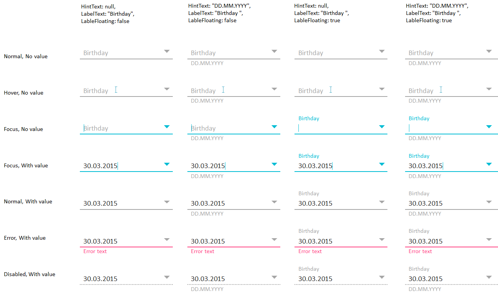

Элемент представления для отображения и редактирования даты.

   

#### Sketch



      

#### Methods

|Name|Description|
|----|-----------|
|GetMode(): [[DatePickerMode]]|Возвращает режим работы элемента.|
|SetMode([[DatePickerMode]] value)|Устанавливает режим работы элемента.|
| | |
|GetMinDate(): datetime|Возвращает минимально возможную дату для выбора.|
|SetMinDate(datetime)|Устанавливает минимально возможную дату для выбора.|
| | |
|GetMaxDate(): datetime|Возвращает максимально возможную дату для выбора.|
|SetMaxDate(datetime)|Устанавливает максимально возможную дату для выбора.|

   

#### Events

|Name|Description|
|----|-----------|
| | |

   

#### Schema

```
{
  "id": "DatePicker",
  "description": "Элемент представления для отображения и редактирования даты",
  "type": "object",
  "extends": {
    "$ref": "http://demo.infinnity.ru:8081/display/MC/BaseTextElement"
  },
  "properties": {
    "Mode": {
      "description": "Режим работы элемента",
      "$ref": "http://demo.infinnity.ru:8081/display/MC/DatePickerMode",
      "default": "Date"
    },
    "MinDate": {
      "description": "Минимально возможная дата для выбора",
      "type": "string",
      "format": "date-time"
    },
    "MaxDate": {
      "description": "Максимально возможная дата для выбора",
      "type": "string",
      "format": "date-time"
    }
  },
  "additionalProperties": false
}
```

   

#### Examples

```
{
  "Label": "Дата рождения",
  "LabelFloating": true,
  "Value": {
    "PropertyBinding": {
      "DataSource": "MainDataSource",
      "Property": "BirthDate"
    }
  }
}
```

 

 

