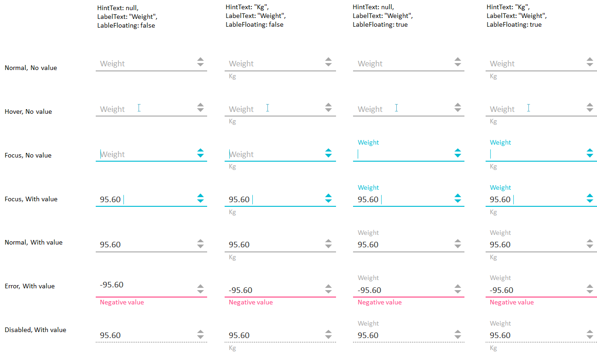

Элемент представления для отображения или редактирования чисел.

   

#### Sketch

  


   

#### Methods

|Name|Description|
|----|-----------|
|GetMinValue(): number|Возвращает минимальное значение.|
|SetMinValue(number value)|Устанавливает минимальное значение.|
| | |
|GetMaxValue(): number|Возвращает максимальное значение.|
|SetMaxValue(number value)|Устанавливает максимальное значение.|
| | |
|GetIncrement(): number|Возвращает приращение значения.|
|SetIncrement(number value)|Устанавливает приращение значения.|

   

#### Events

|Name|Description|
|----|-----------|
| | |

  

#### Schema

```
{
  "id": "NumericBox",
  "description": "Элемент представления для отображения или редактирования чисел",
  "type": "object",
  "extends": {
    "$ref": "http://demo.infinnity.ru:8081/display/MC/BaseTextElement"
  },
  "properties": {
    "MinValue": {
      "description": "Минимальное значение",
      "type": "number"
    },
    "MaxValue": {
      "description": "Максимальное значение",
      "type": "number"
    },
    "Increment": {
      "description": "Приращение значения",
      "type": "number",
      "default": 1
    }
  },
  "additionalProperties": false
}
```

   

#### Examples

```
{
  "Label": "Вес",
  "LabelFloating": true,
  "MinValue": 0.5,
  "MaxValue": 250,
  "Increment": 5,
  "Value": {
    "PropertyBinding": {
      "DataSource": "MainDataSource",
      "Property": "Weight"
    }
  }
}
```

 

 

