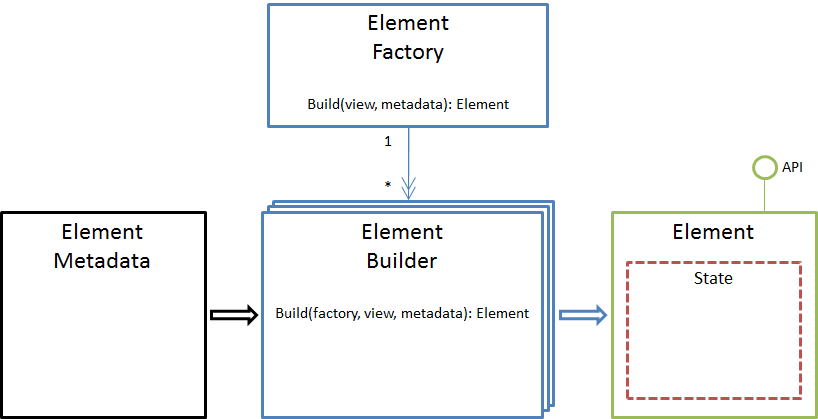

---
layout: default
title: Интерпретация метаданных
position: 1
categories: 
tags: 
---

Интерпретация метаданных является ключевым аспектом клиентской части системы. В данном разделе описывается основной подход, который должен быть положен в основу реализации интерпретатора метаданных вне зависимости от того, на какой платформе будет осуществляться эта интерпретация. Данный подход не имеет каких-либо платформенно-специфичных вещей, поэтому может быть реализован практически на любом языке программирования и на любой платформе. Иными словами, в данном разделе описывается архитектура решения, а не способ ее программной реализации. Тем не менее, чтобы не слишком отдаляться от практики, описание сопровождается примерами программного кода.

 



 

Прежде, чем начать описание, следует дать определения некоторым терминам, которые будут использовать в дальнейшем.

Элемент (Element) - программный объект, с определенным интерфейсом (API), который позволяет запрашивать и/или изменять внутреннее состояние (State) этого объекта. Под элементом в данном контексте может пониматься как само представление, так и любой визуальный или не визуальный элемент представления. Все элементы по своему назначение делятся на типы, каждый из которых описан в рамках данной документации. Для каждого типа элемента определен API и поведение, а если это визуальный элемент, то и способ отображения. Определенный для элементов API должен быть реализован в строгом соответствии с документацией и является опорной точкой не только для написания прикладных скриптов, но и при реализации механизма интерпретации метаданных.

Метаданные элемента (Element Metadata) - описание свойств и/или поведения элемента. Для описания метаданных элементов используется JSON-нотация. Метаданные элемента декларируют то, каким внутренним состоянием должен обладать соответствующий элемент после того, как будет создан. Типы метаданных один к одному соответствуют типам элементов и подробно описаны в рамках данной документации. Также следует отметить, что метаданные элемента могут определять не только декларативные аспекты, но и императивные (например, обработчики событий).

Построитель элемента (Element Builder) - программный объект, позволяющий конструировать элементы определенного типа на основе их метаданных. Иными словами, для каждого типа элемента (для каждого типа метаданных) должен существовать свой построитель. Для конструирования соответствующего элемента построитель должен использовать его API.

Фабрика элементов (Element Factory) - программный объект, который хранит ссылки на все известные построители элементов и предоставляет интерфейс для создания элементов любых известных типов на основе их метаданных. Фабрика элементов создается при старте приложения и в ней регистрируются все известные построители элементов.

 

#### Типы метаданных элемента

Свойства и поведения элемента могут быть описаны с помощью метаданных. Каждому типу элемента соответствует свой тип метаданных, то есть каждый тип элемента описывается стандартным образом, но по-своему. Конечно, в целях унификации и упрощения метаданных элементов был использованы определенные правила при наименовании свойств структур метаданных, поэтому близкие по смыслу или назначению свойства у разных типов метаданных зачастую имеют одинаковое название. Более того, структура метаданных во многом отражает API соответствующего элемента и наоборот. Но даже несмотря на эти правила наименования, которые, безусловно, упрощают многие вещи, у каждого элемента все-таки свои метаданные. Следовательно, на уровне интерпретации метаданных возникает необходимость в определении типа элемента (типа метаданных элемента), для которого осуществляется интерпретация, хотя бы для того, чтобы создать нужный элемент метаданных. Это говорит о том, что метаданные должны хранить не только информацию о элементе, но и информацию о типе элемента.

Для хранения информации о типе элемента был использован следующий достаточно универсальный принцип. Метаданные элемента заворачиваются (wrap) в объект с одним единственным свойством, наименование которого совпадает с наименованием типа метаданных элемента. Таким образом, получив подобную обертку (wrapper), всегда можно извлечь информацию о типе метаданных и выбрать подходящий построитель элемента. Конечно, информацию о типе можно было бы хранить в каком-нибудь специализированном свойстве самого объекта метаданных, но в этом случае могут возникнуть определенные проблемы. Во-первых, наименование этого специализированного свойства может конфликтовать с наименованием свойств метаданных элемента, что не совсем приятно. Во-вторых, информация о типе элемента не имеет прямого отношения к метаданным, а относится к части реализации, связанной с их интерпретацией. В-третьих, подобные объекты нельзя проиндексировать (например, с помощью ElasticSearch), поскольку разные типы метаданных будут иметь разные схемы. Наконец, идея с оборачиванием (wrap) является наиболее естественной, если речь идет о JSON.

```
{
	"TypeName": {
		// Element Metadata
	}
}
```

 

#### Внутреннее состояние элемента

Каждый элемент реализует вполне определенный и задокументированный API, который позволяет запрашивать и/или изменять внутреннее состояние элемента (State). Что в данном контексте понимается под "внутренним состоянием элемента"? Скорей, это один или несколько приватных объектов элемента, доступ к которым осуществляется через публичный API. Например, источник данных может иметь список загруженных с сервера элементов, который вполне подходит под определение "внутреннего состояния". Например, при фильтрации данных или постраничной навигации этот список может изменяться. Что касается визуальных элементов, то в качестве внутреннего состояния может выступать какой-либо визуальный компонент. Благодаря тому, что доступ к внутреннему состоянию осуществляется через API, код, который работает с API (в частности, код построителей элементов и код прикладных скриптов), совершенно не зависит от какой-то конкретной программной библиотеки (например, от библиотеки визуальных компонентов).

 

#### Процесс построения элемента

Собственно вышеприведенная иллюстрация и комментарии к ней поясняют суть всего решения, поэтому осталось внести несколько уточнений относительно причин выбора подобного подхода и способа его реализации. Центральным звеном всего механизма в данном подходе являются построители элементов. Каждый из них реализует один и тот же программный интерфейс, каждый из них занимается конструированием элементов определенного типа, наконец, каждый из них никак не связан с другими построителями и ничего не знает о их существовании. Построитель занимается интерпретацией метаданных элемента конкретного типа и, используя API этого элемента, конструирует результирующий объект, таким образом инкапсулируя всю сложность построения элемента заданного типа. Такой подход позволят совершенно безболезненно расширять модель метаданных или изменять логику построения какого-либо элемента, никак не затрагивая существующий функционал.

 

#### Интерфейс построителя элемента

Каждый построитель реализует один и тот же программный интерфейс, который представлен одним единственным методом Build(). Этот метод принимает на входе три параметра: фабрику элементов (factory); родительское представление (view), к которому относится элемент; метаданные элемента (metadataValue). Этой информации вполне достаточно для построения любого элемента.

```
Build(factory, view, metadataValue);
```

Ниже приведен пример псевдокода построителя элемента [[Button]] (для простоты понимания были исключены проверки на null и т.п). Можно заметить, что код построителя достаточно прост для понимания, не содержит ничего специфичного и сверхъестественного и выполняет только тот узкий круг задач (построение элемента [[Button]]), который и должен выполнять. Построитель создает экземпляр элемента (ButtonElement), затем, используя метаданные и API элемента, осуществляет установку соответствующих свойств элемента. Для построения сторонних элементов (например, для интерпретации Action), использует фабрику элементов (factory). После завершения конструирования построитель возвращает экземпляр объекта. Подобным образом выглядит код абсолютно любого построителя: создание элемента, инициализация элемента на основе метаданных, возврат элемента вызывающему коду. Таким образом, получаем совершенно простое, модульное и тестопригодное решение.

```
class ButtonElementBuilder
{
	object Build(factory, view, metadataValue)
	{
		var button = new ButtonElement(view);
 
		button.SetName(metadataValue.Name);
		button.SetText(metadataValue.Text);
		button.SetEnabled(metadataValue.Enabled);
		button.SetVisible(metadataValue.Visible);
		button.SetImage(metadataValue.Image);
 
		var onClickAction = factory.Build(view, metadataValue.Action);
		button.SetAction(onClickAction);
 
		var onClickHandler = view.GetScript(metadataValue.OnClick.Name);
		button.OnClick = onClickHandler;
 
		return button;
	}
}
```

 

#### Интерфейс фабрики элементов

Чтобы фабрика элементов могла создать элемент заданного типа, необходимо создать и зарегистрировать соответствующий построитель элемента. Для этих целей используется метод Register(), который принимает два параметра: тип метаданных элемента (metadataType); построитель элемента (elementBuilder).

```
Register(metadataType, elementBuilder);
```

Например, так может выглядеть регистрация построителя элемента:

```
factory.Register("Button", new ButtonElementBuilder());
```

Для создания элемента заданного типа определено две перегрузки метода Build(). Первая перегрузка метода Build() используется в случаях, когда метаданные элемента содержат информацию о типе, и принимает на вход два параметра: родительское представление (view), к которому относится элемент; метаданные элемента (metadataValue) с информацией о типе. Вторая перегрузка метода Build() используется в случаях, когда метаданные элемента не содержат информацию о типе, и принимает на вход три параметра: родительское представление (view), к которому относится элемент; тип метаданных элемента (metadataType); метаданные элемента (metadataValue) без информации о типе.

```
Build(view, metadataValue);
Build(view, metadataType, metadataValue);
```

Например, так может выглядеть интерпретация метаданных элемента:

```
// Если метаданные содержат информацию о типе
var button1 = factory.Build(view, { Button: { /* Button Element Metadata */ } });
 
// Если метаданные не содержат информацию о типе
var button2 = factory.Build(view, "Button", { /* Button Element Metadata */ });
```

На базе этих методов можно сделать аналогичные методы, но для создания коллекции элементов на основе коллекции метаданных элементов (metadataValues). Для случаев, когда метаданные содержат информацию о типе, используется перегрузка метода BuildMany() с двумя параметрами, когда метаданные не содержат информацию о типе, используется перегрузка с тремя параметрами.

```
BuildMany(view, metadataValues);
BuildMany(view, metadataType, metadataValues);
```

Например, так может выглядеть интерпретация коллекции метаданных:

```
// Если метаданные содержат информацию о типе
var elements1 = factory.BuildMany(view, [
	{ Button: { /* Button Element Metadata */ } },
	{ PopupButton: { /* PopupButton Element Metadata */ } }
]);
 
// Если метаданные не содержат информацию о типе
var elements1 = factory.BuildMany(view, "Button", [
	{ /* Button Element Metadata */ },
	{ /* Button Element Metadata */ }
]);
```

 

 

