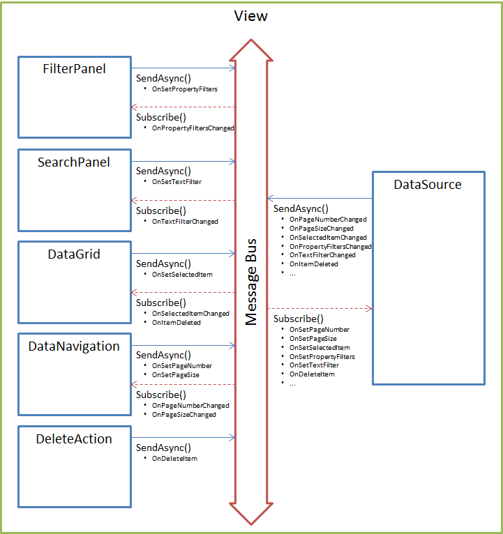

---
layout: default
title: Источник данных
position: 3
categories: 
tags: 
---

Базовая функциональность, которая связана с обменом данными между элементами представления, реализуется с использованием асинхронной шины сообщений (см. раздел [[MessageBus]]). Эти же требования касаются задачи организации взаимодействия с источником данных представления (см. раздел [[DataSource]]). Общая схема взаимодействия между элементами и источником данных через шину сообщений приведена на иллюстрации, полный перечень типов сообщений описан в разделе [[MessageType]]. На иллюстрации приведен пример некоторого представления, который в общем напоминает журнал документов. В рамках этого представления определены несколько визуальных элементов: панель фильтров ([[FilterPanel]]), панель полнотекстового поиска ([[SearchPanel]]), таблица данных ([[DataGrid]]), панель навигации по данным ([[DataNavigation]]) и, например, кнопка, связанная с действием удаления выделенной записи из источника данных ([[DeleteAction]]); а также не визуальный элемент - источник данных ([[DataSource]]). Стрелками показаны потоки данных от элементов к шине и наоборот, а комментарии к стрелкам поясняют, какие сообщения элемент публикует в шину и на какие сообщения шины он подписан. Например, при изменении на панели фильтров, она публикует сообщение-запрос "OnSetPropertyFilters" на фильтрацию данных; источник данных, получив подобное сообщение, осуществляет фильтрацию данных, по результатам которой публикует сообщение-ответ "OnPropertyFiltersChanged".

Почему элементы не могут напрямую обратиться к API источника данных и вызывать необходимые методы? По очень многим причинам. Во-первых, представление может иметь достаточно большое количество визуальных и не визуальных элементов, функционально связанных между собой (под функциональной связью в данном контексте в первую очередь понимается некоторая логика обмена данными между элементами). Более того, со временем количество элементов представления может измениться, количество функциональных связей может измениться, могут появиться новые типы элементов или измениться характер функциональных связей. Если при таких исходных данных функциональную связь между элементами делать императивно, то достаточно быстро произойдет комбинаторный взрыв, и развивать платформу будет невозможно. Во-вторых, прямое обращение к источнику будет осуществляться синхронно (в том же потоке), что приведет к зависанию интерфейса на время выполнения операции, а это крайне недопустимо и нужно, чтобы все операции с источником данных осуществлялись асинхронно (в отдельном потоке). В-третьих, в некоторых событиях может быть заинтересован не только один элемент, а сразу несколько, а реализация такой логики в рамках построителя элемента существенно усложнит его код. Это, пожалуй, основные, но далеко не все причины обоснования данной схемы взаимодействия.

 

 

 

