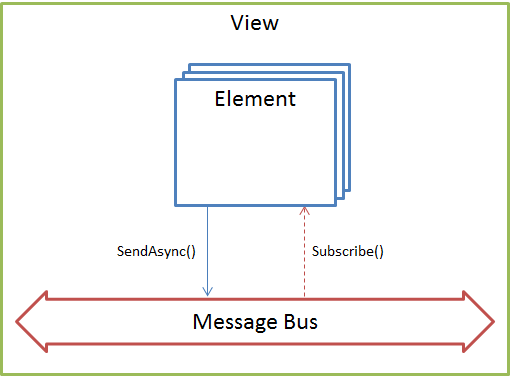

Все функциональные связи между элементами представления, как визуальными, так и не визуальными, в общем случае осуществляются через шину сообщений (см. раздел [[MessageBus]]). Такой подход наиболее удобен при реализации сложных интерфейсов, основанных на модульной архитектуре, где каждый элемент представления является независимым и самодостаточным звеном. Шина сообщений предоставляет строго определенный API, который позволяет отправлять сообщения в шину (см. метод SendAsync) и осуществлять подписку на сообщения определенного типа (см. метод Subscribe). Количество источников (publishers) и подписчиков (subscribers) не лимитировано. Каждый элемент представления может выступать и в качестве источника сообщений, и в качестве подписчика на сообщения. Естественно, шина сообщений не детерминирует моменты отправки сообщений и не отвечает за продолжительность обработки сообщений, единственное, что  гарантирует шина сообщений - доставку сообщения от получателя всем существующим подписчикам.

Отдельно следует отметить, что для каждого экземпляра представления создается свой экземпляр шины сообщений. Это сделано намеренно, чтобы обмен сообщениями в рамках экземпляра одного представления никак не повлиял на экземпляры других представлений и тем самым не повлиял на стабильность работы всего приложения. С другой стороны, изолированная шина сообщений предоставляет гибкий и простой способ для интеграции с внешними компонентами.

 



 

Типы сообщений, которые могут быть отправлены в шину (соответственно, типы сообщений, на которые можно подписаться), определены и задокументированы на уровне API платформы (см. раздел [[MessageType]]). Формат и структура сообщений также определена и задокументирована на уровне API платформы (см. раздел [[MessageBody]]). Естественно, что каждому типу сообщений жестко соответствует определенная структура тела сообщения. Подобная регламентация типов и форматов сообщений совершенно не означает отсутствие возможности расширить набор типов сообщений или изменить формат или структуру самих сообщений. Данная регламентация является частью API, которая необходима для регламентации порядка взаимодействия между элементами при реализации базовой функциональности. Шина сообщений никак не зависит от наименований типов сообщений и тем более от данных, передаваемых в сообщениях. Шина сообщений регламентирует только правила маршрутизации сообщений и в основе этих правил лежит понятие типа сообщения: если источник отправил сообщение с типом "Event1", то шина должна доставить это сообщение всем подписчикам, которые заинтересованы в получении сообщений с типом "Event1". Как видно из приведенного примера, никаких ограничений на наименования типов и на передаваемые данные нет, то есть фактически можно отправлять все, что угодно и подписываться на все, что угодно. Это дает все предпосылки использовать шину не только на системном уровне для реализации базовой функциональности, но и в прикладных скриптах (см. раздел [[Script]]).

При реализации базовой функциональности, которая связана с обменом данными между элементами представления, правила публикации сообщений в шину и правила подписки на сообщения шины задаются на уровне построителя, в момент выполнения интерпретации данных представления. Таким образом, вся базовая логика, связанная с обменом данными между элементами представления, инкапсулирована в построителе соответствующих элементов, соответственно, основные коммуникации выполняются абсолютно прозрачно как для самих элементов, так и для прикладных разработчиков. 

Ниже приведен пример псевдокода построителя элемента для источника данных (в частности, [[DocumentDataSource]]), в котором элемент представлен и в качестве источника сообщений, и в качестве подписчика на сообщения. Код построителя, используя API элемента и API шины сообщений, декларирует моменты времени, когда источник данных будет осуществлять публикацию сообщений в шину, и на какие сообщения от внешних элементов он будет подписан. В примере приведены два вспомогательных метода - NotifyWhenEvent() и SubscribeOnEvent() - первый осуществляет подписку на указанное событие элемента и публикует это событие в шину при его возникновении, второй осуществляет подписку на сообщение шины и вызывает соответствующий обработчик, объявленный в рамках построителя.

```
class DocumentDataSourceElementBuilder
{
	object Build(factory, view, metadataValue)
	{
		var dataSource = new DocumentDataSourceElement(view, metadataValue.ConfigId, metadataValue.DocumentId);
 
		dataSource.SetName(metadataValue.Name);
 
		// До загрузки представления источник данных не активен
		dataSource.SuspendUpdate();
 
		// Публикация сообщений в шину при возникновении событий в источнике
		NotifyWhenEvent(dataSource, "OnPageNumberChanged");
		NotifyWhenEvent(dataSource, "OnPageSizeChanged");
		NotifyWhenEvent(dataSource, "OnSelectedItemChanged");
		...
 
		// Подписка источника на сообщения шины от внешних элементов
		SubscribeOnEvent(dataSource, "OnLoaded", OnLoadedHandler);
		SubscribeOnEvent(dataSource, "OnSetPageNumber", OnSetPageNumberHandler);
		SubscribeOnEvent(dataSource, "OnSetPageSize", OnSetPageSizeHandler);
		SubscribeOnEvent(dataSource, "OnSetSelectedItem", OnSetSelectedItemHandler);
		...
 
		return dataSource;
	}
 
	// Обработчики сообщений шины
 
	void OnLoadedHandler(dataSource, arguments)
	{
		dataSource.ResumeUpdate();
	}
 
	void OnSetPageNumberHandler(dataSource, arguments)
	{
		if (CanHandle(dataSource, arguments))
		{
			dataSource.SetPageNumber(arguments.Value);
		}
	}
 
	void OnSetPageSizeHandler(dataSource, arguments)
	{
		if (CanHandle(dataSource, arguments))
		{
			dataSource.SetPageSize(arguments.Value);
		}
	}
 
	void OnSetSelectedItemHandler(dataSource, arguments)
	{
		if (CanHandle(dataSource, arguments))
		{
			dataSource.SetSeletedItem(arguments.Value);
		}
	}
 
	...
 
	bool CanHandle(dataSource, arguments)
	{
		return (arguments.DataSource == dataSource.GetName());
	}
}
 
void NotifyWhenEvent(element, messageType)
{
	var prevHandler = element[messageType];
 
	element[messageType] = function(context, arguments) {
		if (prevHandler != null)
		{
			prevHandler(context, arguments);
		}
 
		var messageBus = element.GetView().GetExchange();
 
		messageBus.SendAsync(messageType, arguments);
	};
}


void SubscribeOnEvent(element, messageType, messageHandler)
{
	var messageBus = element.GetView().GetExchange();
 
	messageBus.Subscribe(messageType, function(arguments) {
		messageHandler(element, arguments);
	});
}
```

 

 

