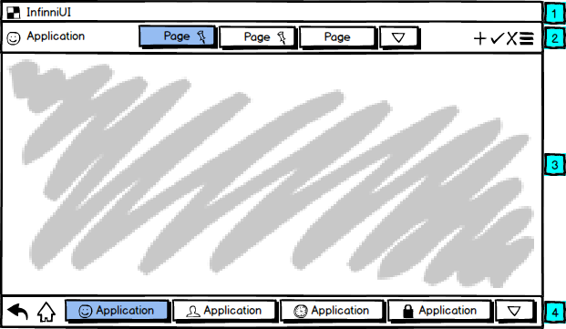

Общая схема организации интерфейса приведена на рисунке ниже.

    

    

Сверху вниз обозначены следующие блоки:

[[Панель состояния (Status Bar)|Панель состояния (Status Bar)]]  
Отображается всегда. Предоставляет справочную информацию о системе, а также доступ действиям, непосредственно связанным с текущим пользователем системы.[[Панель действий (Action Bar)|Панель действий (Action Bar)]]  
Может отсутствовать. Предоставляет функционал по навигации внутри приложения, а также доступ к действиям, относящимся к текущему режиму работы приложения.[[Область представления (View Panel)|Область представления (View Panel)]]  
Отображается всегда. Контейнер, занимающий основную часть экрана, в котором размещается текущая страница приложения.[[Панель глобальной навигации (Global Navigation Bar)|Панель глобальной навигации (Global Navigation Bar)]]  
Отображается всегда. Предоставляет функционал по навигации между работающими приложениями.   

Предполагается, что работа с системой будет вестись в полноэкранном режиме, поэтому интерфейс системы в общем случае является единственной рабочей (операционной) средой пользователя. На этом уровне появляются два новых понятия: приложение (Application) и страница приложения (Page). Под приложением (Application) понимается логически сгруппированный прикладной функционал. В качестве примера можно провести аналогию между приложением (Application) и какой-либо прикладной программой, которую пользователь может запустить в операционной системе. Под страницей приложения понимается любое представление ([[View]]), открытое в рамках данного приложения. Таким образом, рассматриваемая схема интерфейса предполагает наличие двух уровней навигации: глобальной навигации (между работающими приложениями) и навигации внутри приложения (между представлениями приложения). Важный момент: любая навигация осуществляется с полным сохранением состояния..

На уровне метаданных таких понятий, как приложение (Application) и страница приложения (Page), не существует, поскольку эти вещи находятся на более высоком уровне абстракции, нежели представление ([[View]]), плюс, относятся к способу реализации клиентской части. С технической точки зрения и то и другое является обычным представлением ([[View]]).

 

 

