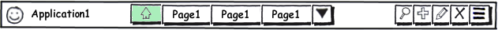

Панель действий (Action Bar) располагается под [[Панель состояния (Status Bar)|Панель состояния (Status Bar)]], по умолчанию отображается всегда, но может отсутствовать, если в метаданных представления указаны соответствующие настройки; не меняет своего размера и расположения. Предоставляет функционал по навигации внутри приложения, а также доступ к действиям, относящимся к текущему режиму работы приложения.

   

   

#### Элементы панели действий

На панели действий можно выделить следующие элементы:

* Иконка приложения (или текущей страницы)  
Каждое приложение (или страница) может иметь иконку, которая символизирует данное приложение (или страницу). См. свойство [[View]].Image.  
Иконка приложения должна совпадать с иконкой приложения в главном меню системы; иконку приложения также должна учитывать [[Панель глобальной навигации (Global Navigation Bar)|Панель глобальной навигации (Global Navigation Bar)]].

* Название приложения (или текущей страницы)  
Каждое приложение (или страница) может иметь текстовый заголовок с наименованием данного приложения (или страницы). См. свойства [[View]].Text и [[BaseLinkView]].Text.  
Заголовок приложения должен совпадать с заголовком в главном меню системы; заголовок приложения также должна учитывать [[Панель глобальной навигации (Global Navigation Bar)|Панель глобальной навигации (Global Navigation Bar)]].

* Список открытых страниц приложения  
Позволяет переключаться между открытыми страницами приложения.  
Первая страница в списке не может быть закрыта и символизирует главную страницу приложения.  
Вновь открываемые страницы располагаются за главной страницей приложения и по умолчанию могут быть закрыты.

* Список доступных действий приложения  
Список доступных действий, относящихся к активной странице приложения.

 

#### Список открытых страниц приложения

Список открытых страниц приложения позволяет переключаться между открытыми страницами приложения. Визуально список может быть выполнен в виде вкладок или кнопок, каждая из которых один к одному связана с соответствующей страницей приложения. Каждая вкладка имеет заголовок, совпадающий с заголовком страницы. В общем случае, если не указано иных настроек, каждую вкладку можно закрыть, закрепить или открепить. Закрытие вкладки закрывает соответствующую страницу и удаляет вкладку из списка. Закрепление вкладки фиксирует положение вкладки в списке открытых страниц. Открепление вкладки - операция, обратная закреплению.

Первой вкладкой идет главная страница приложения, далее идут закрепленные вкладки (в порядке закрепления), затем идут незакрепленные вкладки в порядке открытия. Опционально незакрепленные вкладки могут менять свое приложение в зависимости от частоты использования. Для перехода на нужную страницу пользователю достаточно выделить соответствующую вкладку в списке. Если приложение открывает новые представления ([[View]]) с пометкой того, что они должны быть открыты в контексте приложения (см. режим [[OpenMode]].Page), в список добавляется новая вкладка, которая становится активной.

 

#### Поведение вкладок списка открытых страниц приложения

В зависимости от разрешения экрана (или размеров окна браузера) список одновременно видимых по горизонтали открытых вкладок может меняться. По этой причине нужно реализовать такой алгоритм, который обеспечит удобную навигацию по вкладкам даже в случае малых размеров экрана. Предложенный ниже алгоритм был заимствован после рассмотрения нескольких популярных приложений, работающих со вкладками. В последующем этот алгоритм может быть изменен или усовершенствован.

Во-первых, размер вкладок следует сделать фиксированным. Если текст заголовка не умещается во вкладку, он усекается. Во-вторых, в крайнем правом углу должна располагаться кнопка, по нажатию на которую должен раскрываться выпадающий список всех открытых вкладок. Выпадающий список отображает все открытые вкладки, отсортированные по заголовку в алфавитном порядке. Ширина выпадающего списка должна быть такой, чтобы умещать текст самого длинного заголовка. В-третьих, активная вкладка визуально выделяется, как в списке видимых вкладок, так и в выпадающем списке всех открытых вкладок. В-четвертых, операции закрытия, закрепления и открепления вкладки (при их доступности) должны быть доступны, как в списке видимых вкладок, так и в выпадающем списке всех открытых вкладок. Наконец, остался вопрос относительно позиционирования в списке видимых вкладок. Первой в списке идет вкладка главной страницы приложения, далее должны идти закрепленные вкладке в порядке закрепления, затем должны идти незакрепленные вкладки, поведение которых можно описать следующим набором правил:

* Новая вкладка первой в списке, сдвигая остальные видимые вкладки вправо.
* При выборе видимой вкладки из выпадающего списка положение вкладок остается неизменным.
* При выборе невидимой вкладки из выпадающего списка, она занимает место крайней правой видимой вкладки, сдвигая остальные вкладки влево.
* При переключении между видимыми вкладками, расположение вкладок остается неизменным.

  

Ниже приведена иллюстрация поведения незакрепленных вкладок. Активные вкладки выделены зеленым цветом. Также показано содержимое выпадающего списка на каждом шаге.

   

  

#### Список доступных действий приложения

Список доступных действий располагается в правой части панели действий. Данный список может настраиваться на уровне каждого представления ([[View]]). Если представление не содержит соответствующих настроек, список доступных действий будет пустым. В общем случае действия, доступные в этом списке, можно охарактеризовать, как "наиболее типичные операции, совершаемые в контексте данного приложения (или данной страницы приложения)". Вызов всех "нетипичных операций" осуществляется с использованием элементов управления, находящихся на странице представления.

 

#### Рекомендации по настройке списка доступных действий

Нужно, чтобы при виде того или иного действия в списке у пользователя системы срабатывал "условный рефлекс", даже если он ни разу не работал с данной функциональностью. Иными словами, интерфейс системы должен быть интуитивен и предсказуем. Собственно по этой причине есть определенные рекомендации по настройке списка доступных действий. Первая рекомендация уже звучала выше: доступные в списке действия могут быть охарактеризованы, как "наиболее типичные операции, совершаемые в контексте данного приложения (или данной страницы приложения)". Вторая рекомендация относится к визуально попытке обобщить наиболее характерные действия, список которых приведен ниже. (Иконки, ассоциация с действиями и типы представлений приведены лишь в качестве рекомендаций.)

   

|Иконка|Наименование|Описание|Типы представлений|
|------|------------|--------|------------------|
||Поиск|Отображает элемент для ввода поискового запроса. |[[ViewType]].ListView[[ViewType]].SelectView|
| | | | |
||Добавить документ ([[AddAction]])|Открывает форму добавления нового документа.|[[ViewType]].ListView|
||Редактировать документ ([[EditAction]])|Открывает форму редактирования выделенного документа.|[[ViewType]].ListView|
||Удалить документ ([[DeleteAction]])|Спрашивает пользователя о необходимости удаления выделенного документа и удаляет его при подтверждении.|[[ViewType]].ListView|
| | | | |
||Сохранить документ ([[SaveAction]])|Сохраняет изменения выделенного документа.|[[ViewType]].EditView|
||Отменить изменения ([[CancelAction]])|Отменяет изменения и закрывает текущее представление.|[[ViewType]].EditView|
||Открыть представление ([[OpenViewAction]])|Открытие новой страницы или переход в другое приложение.|[[ViewType]].EditView[[ViewType]].ListView|
| | | | |
||Открыть печатную форму или отчет|Открытие печатной формы или отчета.|[[ViewType]].EditView[[ViewType]].ListView|
| | | | |
||Показать прочие действия|Отобразить список прочих доступных действий.| |

 

 

