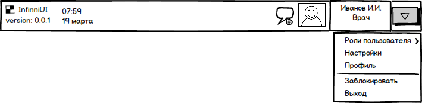
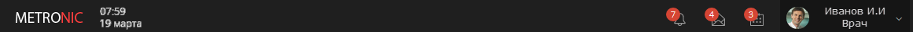
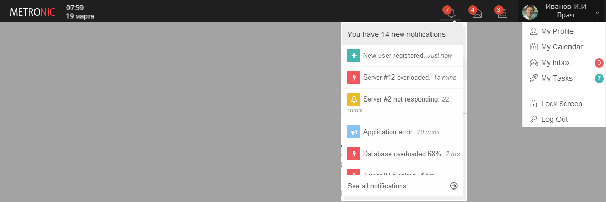

---
layout: default
title: Панель состояния (Status Bar)
position: 0
categories: 
tags: 
---

Панель состояния (Status Bar), располагается в самой верхней части экрана, отображается всегда, не меняет своего размера и расположения. Предоставляет справочную информацию о системе, а также доступ действиям, непосредственно связанным с текущим пользователем системы.

   

   

#### Элементы панели состояния

На панели состояния можно выделить следующие элементы:   

* Логотип системы  
Располагается в левой части панели.  

* Наименование системы  
Располагается в левой части панели, за логотипом.   

* Номер версии системы  
Располагается рядом или под наименованием системы.  
Опционально по нажатию может появляться окно с подробной информацией о системе.   

* Системная дата и время  
Располагается в левой части панели, за наименованием системы. Носит информационный характер.  
Опционально по клику может открываться календарь (без возможности изменения даты и времени).   

* Напоминания пользователя  
Располагается в правой части панели, перед фотографией пользователя.  
Иконка отображает общее количество напоминаний. При нажатии на иконку открывается список напоминаний с возможностью перехода в соответствующее приложение.   

* Фотография пользователя  
Располагается в правой части панели, перед отображаемым именем пользователя.  
Если пользователь не имеет фотографии, отображается пиктограмма, соответствующая активной роли пользователя.

* Отображаемое имя пользователя  
Располагается в правой части панели, за фотографией пользователя.  
Как правило, отображает полное имя (ФИО) пользователя.

* Активная роль пользователя в системе  
Располагается в правой части панели, под отображаемым именем пользователя.  
Отображает наименование активной прикладной роли пользователя в системе.

* Выпадающее системное меню пользователя  
Располагается в правой части панели.  
При нажатии раскрывается список возможных действий, непосредственно связанных с текущим пользователем системы.

 

#### Выпадающее системное меню пользователя

Выпадающее системное меню предоставляет список возможных действий, непосредственно связанных с текущим пользователем системы.

На данный момент предусмотрены следующие действия:

* Роли пользователя  
Раскрывает список доступных прикладных ролей пользователя.  
При выборе какой-либо роли из списка меняется текущая активная роль пользователя в системе.

* Настройки  
Открывает окно настроек системы, доступных пользователю. (Содержимое пока не продумано.)

* Профиль  
Открывает окно настроек учетной записи пользователя. (Содержимое пока не продумано.)

* Выход  
Закрывает сеанс работы с системой от имени текущего пользователя, переводит на экран приглашения входа в систему.

 

#### Примерный внешний вид

   

 

 

