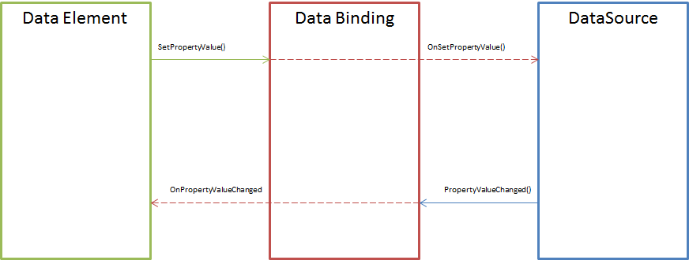

---
layout: default
title: Привязка к данным
position: 4
categories: 
tags: 
---

Привязка данных предназначена для описания связи между элементами представления и источником данных. Иначе говоря, благодаря привязке данных, данные отображаются в нужных элементах представления, а при редактировании значений элементов представления введенные значения сохраняются в нужных свойствах редактируемого документа. Таким образом, базовый API привязки данных (см. раздел [[BaseDataBinding]]) предоставляет инфраструктуру для реализации так называемой двунаправленной (TwoWay) привязки, при которой источник данных обновляется, если изменения произошли в соответствующем элементе представления, и, наоборот, элемент представления обновляется, если изменения произошли в соответствующем источнике данных. Таким образом, привязка данных скрывает всю сложность синхронизации между элементом представления и источником данных, что в значительной степени упрощает код и обеспечивает предсказуемость поведения всех элементов.

 



 

Базовый API привязки данных описан в разделе [[BaseDataBinding]], поэтому здесь будут рассмотрены только примеры использования привязки данных на уровне построителя элемента и на уровне источника данных, а также возможный способ реализации привязки. Для начала рассмотрим часть кода построителя элемента для [[TreeView]], которая отвечает за привязку к источнику данных. Что делает этот код? Во-первых, используя метаданные привязки, создает привязку данных через фабрику элементов (предполагается, что для каждого типа привязки данных существует соответствующий построитель, зарегистрированный в фабрике). Во-вторых, осуществляет подписку на событие OnPropertyValueChanged, которое происходит при изменении источника, на который ссылается привязка. Если источник меняется, срабатывает обработчик, который вызывает метод элемента SetItems(), вследствие чего происходит обновление списка в [[TreeView]]. (Атрибут Value аргументов события OnPropertyValueChanged содержит актуальное значение источника данных.)

```
class TreeViewElementBuilder
{
	object Build(factory, view, metadataValue)
	{
		var treeView = new TreeViewElement(view);
 
		...
 
		// Привязка элемента к источнику данных
		var itemsDataBinding = factory.Build(view, metadataValue.Items);
		itemsDataBinding.OnPropertyValueChanged += function(context, arguments) { treeView.SetItems(arguments.Value); };
 
		...

		return treeView;
	}
}
```

 

Выше рассмотрен пример реализации однонаправленной привязки от источника данных к элементу представления (при обновлении источника обновляется список данных в [[TreeView]]). Не многим сложней выглядит двунаправленная привязка, которая используется для элементов представления, связанных с редактированием данных. Рассмотрим часть кода построителя элемента для [[TextBox]], которая реализует двунаправленную привязку. Относительно привязки элемента к источнику здесь все аналогично: осуществляется подписка на событие OnPropertyValueChanged, обработчик которого обновляет данные элемента, вызывая метод SetValue(). Что касается привязки источника данных к элементу, тут также все просто: осуществляется подписка на событие элемента OnValueChanged, которое происходит при изменении значения у элемента. Если значение элемента меняется, срабатывает обработчик, который вызывает метод SetPropertyValue() и передает ему актуальное значение элемента, вследствие чего происходит обновление источника данных.

```
class TextBoxElementBuilder
{
	object Build(factory, view, metadataValue)
	{
		var textBox = new TextBoxElement(view);
 
		...
 
		// Привязка элемента к источнику данных
		var valueDataBinding = factory.Build(view, metadataValue.Value);
		valueDataBinding.OnPropertyValueChanged += function(context, arguments) { textBox.SetValue(arguments.Value); };
 
		// Привязка источника данных к элементу
		textBox.OnValueChanged += function(context, arguments) { valueDataBinding.SetPropertyValue(textBox.GetValue()); };
 
		...

		return textBox;
	}
}
```

 

Остался вопрос относительно реализации привязки данных. Для примера рассмотрим реализацию привязки данных к свойству источника данных ([[PropertyBinding]]), так как это самый распространенный случай привязки. Привязка данных является простым медиатором между элементом представления и источником данных, поэтому его реализация достаточно простая. Ниже приведена реализация привязки [[PropertyBinding]], записанная в объектно-ориентированном стиле. Конструктор принимает ссылку на представление (view), наименование источника данных (dataSource) и путь к свойству элемента источник данных (property). Соответственно, методы GetView(), GetDataSource() и GetProperty() возвращают полученные в конструкторе значения. Наибольший интерес представляют методы SetPropertyValue() и PropertyValueChanged(), поскольку они реализуют логику двунаправленной (TwoWay) привязки.

Метод SetPropertyValue() вызывает элемент представления для оповещения источника данных об изменениях. В качестве способа оповещения источника данных используется событие OnSetPropertyValue, на которое должен быть подписан соответствующий источник. Метод PropertyValueChanged() вызывает источник данных для оповещения элемента представления об изменениях. В качестве способа оповещения элемента используется событие OnPropertyValueChanged, на которое должен быть подписан соответствующий элемент. Эти правила и лежат в основе реализации данных методов. Метод SetPropertyValue() определяет, действительно ли изменилось значение элемента, и, если так, вызывает обработчик события OnSetPropertyValue. Метод PropertyValueChanged() определяет, действительно ли изменилось значение источника данных, и, если так, вызывает обработчик события OnPropertyValueChanged.

```
class PropertyBindingElement
{
	public PropertyBindingElement(View view, string dataSource, string property)
	{
		_view = view;
		_dataSource = dataSource;
		_property = property;
	}
 
 
	private readonly View _view;
 
	public View GetView()
	{
		return _view;
	}
 
 
	private readonly string _dataSource;
 
	public string GetDataSource()
	{
		return _dataSource;
	}
 
 
	private readonly string _property;
 
	public string GetProperty()
	{
		return _property;
	}
 
 
	private object _value;
 
	public void SetPropertyValue(object value)
	{
		if (Equals(_value, value) == false)
		{
			_value = value;
			InvokePropertyValueEventHandler(OnSetPropertyValue);
		}
	}
 
	public void PropertyValueChanged(object value)
	{
		if (Equals(_value, value) == false)
		{
			_value = value;
			InvokePropertyValueEventHandler(OnPropertyValueChanged);
		}
	}
 
	public ScriptDelegate OnSetPropertyValue { get; set; }
 
	public ScriptDelegate OnPropertyValueChanged { get; set; }
 
 
	private void InvokePropertyValueEventHandler(ScriptDelegate handler)
	{
		var context = _view.GetContext();
 
		var arguments =
			{
				Source = this,
				DataSource = _dataSource,
				Property = _property,
				Value = _value
			};
 
		handler(context, arguments);
	}
}
```

 

Наконец, остался вопрос относительно построителя данных для привязки [[PropertyBinding]] и регистрации привязки в источнике данных.

```
class PropertyBindingElementBuilder
{
	object Build(factory, view, metadataValue)
	{
		var dataBinding = new PropertyBindingElement(view, metadataValue.DataSource, metadataValue.Property);
		var dataSource = view.GetDataSource(metadataValue.DataSource);
		dataSource.AddDataBinding(dataBinding);
		return dataBinding;
	}
}
```

 

Метод регистрации привязки в источнике данных AddDataBinding() добавляет привязку в коллекцию привязок _dataBindings и подписывает источник данных на событие изменения значения в элементе данных OnSetPropertyValue. Обработчик этого события - метод OnSetPropertyValueHandler() - изменяет соответствующее свойство выделенного элемента, используя некоторую вспомогательную функцию SetProperty(), после чего оповещает другие элементы представления, которые подписаны на это же свойство.

```
class DataSourceElement
{
	...
 
	void AddDataBinding(dataBinding)
	{
		_dataBindings.Add(dataBinding);
 
		dataBinding.OnSetPropertyValue += OnSetPropertyValueHandler;
	}
 
	void OnSetPropertyValueHandler(context, arguments)
	{
		var propertyName = arguments.Property;
		var propertyValue = arguments.Value;

		if (propertyName != null && propertyName != "")
		{
			// Изменение свойства выделенного элемента
 
			var selectedItem = GetSelectedItem();
 
			if (selectedItem != null)
			{
				SetProperty(selectedItem, propertyName, propertyValue);
			}
 
			// Оповещение всех привязок, которые связаны со свойством
 
			foreach (var dataBinding in _dataBindings)
			{
				if (dataBinding.GetProperty() == propertyName)
				{
					dataBinding.PropertyValueChanged(propertyValue);
				}
			}
		}
	}
}
```

 

У источника данных также определены два события - OnItemsUpdated (обновление данных) и OnSelectedItemChanged (изменение выделенного элемента источника данных), при наступлении которых источник данных должен обновить нужные привязки. На источник данных может ссылаться какой-нибудь список (например, [[TreeView]]), тогда при обновлении данных в источнике (при наступлении события OnItemsUpdated), нужно обновить данные в этом списке. Если какой-нибудь элемент (например, [[TextBox]]) ссылается на свойство выделенного элемента источника данных, тогда при изменении выделенного элемента источника данных (при наступлении события OnSelectedItemChanged), нужно обновить значение в этом элементе. Данную логику можно организовать, осуществив подписку на соответствующие события, например, прямо в конструкторе источника данных или в момент его создания.

```
class DataSourceElement
{
	DataSourceElement(...)
	{
		...
 
		OnItemsUpdated += OnItemsUpdatedHandler;
		OnSelectedItemChanged += OnSelectedItemChangedHandler;
 
		...
	}
  
	void OnItemsUpdatedHandler(context, arguments)
	{
		var items = arguments.Value;
 
		// Оповещение всех привязок, которые связаны с самим источником данных
 
		foreach (var dataBinding in _dataBindings)
		{
			var propertyName = dataBinding.GetProperty();
 
			if (propertyName == null || propertyName == "")
			{
				dataBinding.PropertyValueChanged(items);
			}
		}
	}
 
	void OnSelectedItemChangedHandler(context, arguments)
	{
		var selectedItem = arguments.Value;
 
		// Оповещение всех привязок, которые связаны со свойствами выделенного элемента
 
		foreach (var dataBinding in _dataBindings)
		{
			var propertyName = dataBinding.GetProperty();
 
			if (propertyName != null && propertyName != "")
			{
				var propertyValue = GetProperty(selectedItem, propertyName);
				dataBinding.PropertyValueChanged(propertyValue);
			}
		}
	}
}
```

 

 

