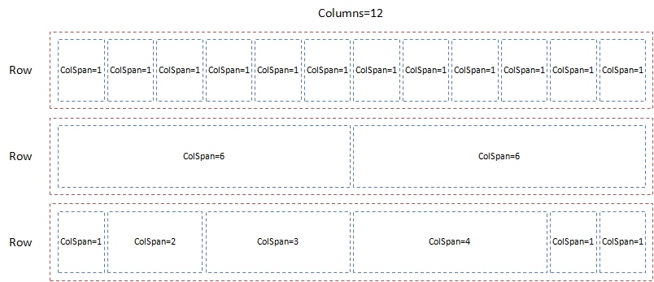
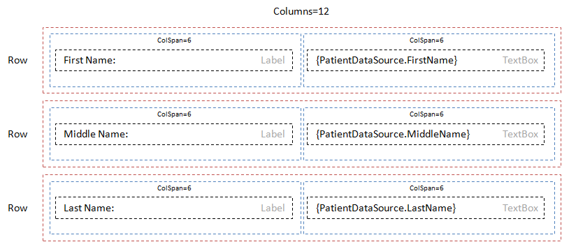

Контейнер элементов представления в виде сетки.

  


  


 

Сетка должна удовлетворять следующим условиям:

* Границы строк и ячеек не отображаются.
* Сетка занимает все доступное пространство по ширине.
* Высота строки должна быть равна высоте самого большого элемента.
* Ячейки могут размещать внутри себя любые элементы представления, в том числе другие сетки.

  

|Name|Description|
|----|-----------|
|GetColumns(): integer|Возвращает количество колонок.|
|SetColumns(integer value)|Устанавливает количество колонок.|
|AddRow(): [[GridPanelRow]]|Добавляет строку.|
|GetRows(): array<[[GridPanelRow]]>|Возвращает список строк.|

|Name|Description|
|----|-----------|
| | |

    

```
{
	"id": "GridPanel",
	"description": "Контейнер элементов представления в виде сетки",
	"type": "object",
	"extends": {
		"$ref": "http://demo.infinnity.ru:8081/display/MC/Element"
	},
	"properties": {
		"Columns": {
			"description": "Количество колонок",
			"type": "integer",
			"default": 12
		},
		"Rows": {
			"description": "Список строк",
			"type": "array",
			"items": {
				"$ref": "http://demo.infinnity.ru:8081/display/MC/GridPanelRow"
			}
		}
	}
}
```

 

```
{
	"Name": "GridPanel1",
	"Rows": [
		{
			"Cells": [
				{
					"ColumnSpan": 6,
					"Items": [
						{
							"Label": {
								"Name": "FirstNameLabel",
								"Text": "First Name:"
							}
						}
					]
				},
				{
					"ColumnSpan": 6,
					"Items": [
						{
							"TextBox": {
								"Name": "FirstNameEditor",
								"Value": {
									"PropertyBinding": {
										"DataSource": "PatientDataSource",
										"Property": "FirstName"
									}
								}
							}
						}
					]
				}
			]
		},
		{
			"Cells": [
				{
					"ColumnSpan": 6,
					"Items": [
						{
							"Label": {
								"Name": "MiddleNameLabel",
								"Text": "Middle Name:"
							}
						}
					]
				},
				{
					"ColumnSpan": 6,
					"Items": [
						{
							"TextBox": {
								"Name": "MiddleNameEditor",
								"Value": {
									"PropertyBinding": {
										"DataSource": "PatientDataSource",
										"Property": "MiddleName"
									}
								}
							}
						}
					]
				}
			]
		},
		{
			"Cells": [
				{
					"ColumnSpan": 6,
					"Items": [
						{
							"Label": {
								"Name": "LastNameLabel",
								"Text": "Last Name:"
							}
						}
					]
				},
				{
					"ColumnSpan": 6,
					"Items": [
						{
							"TextBox": {
								"Name": "LastNameEditor",
								"Value": {
									"PropertyBinding": {
										"DataSource": "PatientDataSource",
										"Property": "LastName"
									}
								}
							}
						}
					]
				}
			]
		}
	]
}
```

 

Ниже приведена схема расположения элементов для приведенного выше примера.

 



 

 

