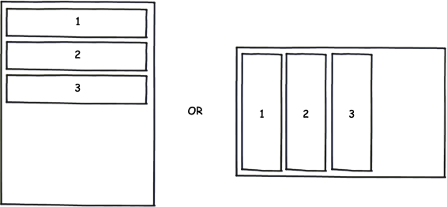

Контейнер элементов представления в виде стека.

 



 

|Name|Description|
|----|-----------|
|GetOrientation(): [[StackPanelOrientation]]|Возвращает ориентацию стека.|
|SetOrientation([[StackPanelOrientation]] value)|Устанавливает ориентацию стека.|
|AddItem([[Element]] item)|Добавляет дочерний элемент.|
|RemoveItem([[Element]] item)|Удаляет дочерний элемент.|
|GetItem(string name): [[Element]]|Возвращает дочерний элемент по имени.|
|GetItems(): array<[[Element]]>|Возвращает список дочерних элементов.|

|Name|Description|
|----|-----------|
| | |

  

```
{
	"id": "StackPanel",
	"description": "Контейнер элементов представления в виде стека",
	"type": "object",
	"extends": {
		"$ref": "http://demo.infinnity.ru:8081/display/MC/Element"
	},
	"properties": {
		"Orientation": {
			"description": "Ориентация стека",
			"$ref": "http://demo.infinnity.ru:8081/display/MC/StackPanelOrientation",
			"default": "Vertical"
		},
		"Items": {
			"description": "Список дочерних элементов",
			"type": "array",
			"items": [
				{
					"$ref": "http://demo.infinnity.ru:8081/display/MC/LayoutPanel"
				},
				{
					"$ref": "http://demo.infinnity.ru:8081/display/MC/ActionElement"
				},
				{
					"$ref": "http://demo.infinnity.ru:8081/display/MC/DataElement"
				}
			]
		}
	}
}
```

 

 

